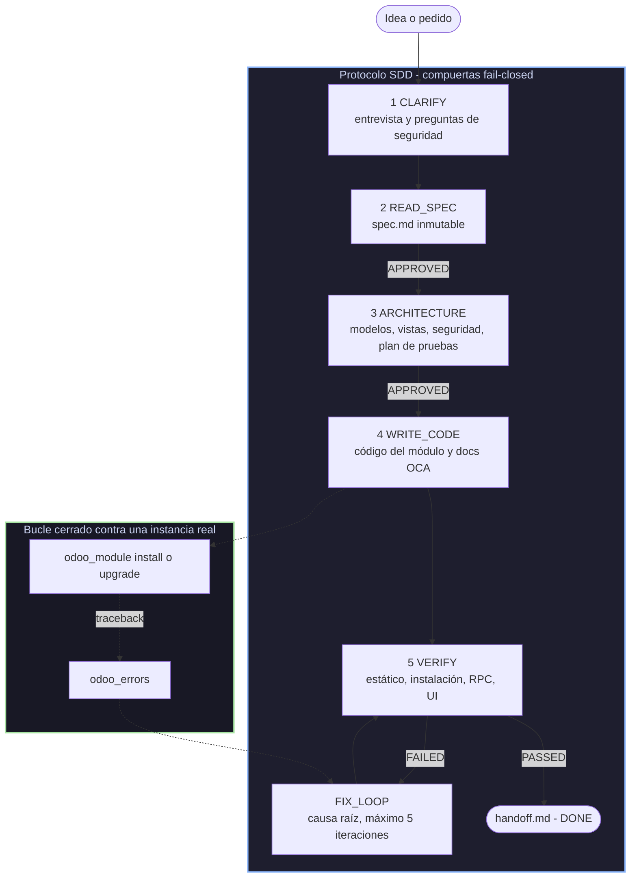

# Spec-Driven Development para Odoo

<div align="center">

<h3>Convertí DeepSeek Harness en un taller Odoo de bucle cerrado:<br/>spec → arquitectura → código → verificación, contra una instancia real</h3>

<!-- Los badges se resuelven al publicar en npm y hacer público el repo en
     GitHub bajo fhidalgodev/dsh-odoo-sdd. Actualiza los enlaces si publicas
     bajo otro propietario. -->
<p align="center">
  <a href="https://www.npmjs.com/package/dsh-odoo-sdd"></a>
  <a href="https://github.com/fhidalgodev/dsh-odoo-sdd/actions/workflows/ci.yml"></a>
  <a href="./LICENSE"></a>
  <a href="https://www.npmjs.com/package/dsh-odoo-sdd"></a>
  <a href="https://github.com/fhidalgodev/dsh-odoo-sdd/stargazers"></a>
  <a href="https://github.com/fhidalgodev/dsh-odoo-sdd/graphs/contributors"></a>
  <a href="https://github.com/fhidalgodev/dsh-odoo-sdd/discussions"></a>
</p>

<p align="center">
  <a href="README.md"><b>🇬🇧 English</b></a> &nbsp;•&nbsp;
  <a href="README.es.md"><b>🇪🇸 Español</b></a>
</p>

<p align="center">
  <b>Autor:</b> <a href="https://github.com/fhidalgodev">Franyer Hidalgo</a> — <code>fhidalgo.dev@gmail.com</code>
</p>

<table align="center">
  <tr>
    <td align="center">
      ⭐ <strong>Si el plugin te ahorra tiempo, una estrella ayuda mucho</strong> — es la señal que mantiene vivo el desarrollo.
      <br><br>
      🐛 <strong>¿Encontraste un bug o querés una funcionalidad?</strong> Abrí un issue en el idioma que quieras. Los reportes reproducibles y los "esto no funcionó" honestos son lo más útil que podés mandar.
    </td>
  </tr>
</table>

</div>

---

## ⚡ Resumen

`dsh-odoo-sdd` convierte **DeepSeek Harness** en un pipeline de desarrollo Odoo
guiado por especificación (SDD). Dos ideas lo sostienen:

- **Bucle de feedback cerrado** — el agente instala y actualiza módulos, lee el
  traceback del servidor y reintenta contra una instancia Odoo **real y en
  marcha**. El plugin nunca levanta Docker ni `odoo-bin`: vos le apuntás a una
  instancia que ya tenés (dev/staging) mediante un `.env` gitignored, y las tools
  hablan JSON-RPC estándar.
- **Seguridad del pipeline** — cada fase persiste en disco, las compuertas son
  fail-closed con marcador `APPROVED` explícito, tres fallos consecutivos fuerzan
  un diagnóstico de causa raíz, las iteraciones verify/fix están acotadas,
  `stop.md` detiene todo, y los veredictos son honestos: una verificación fallida
  persiste como FAILED y nunca puede reportarse como éxito.

> [!NOTE]
> **Lo que NO es:** un orquestador de infraestructura, un gestor de credenciales
> por chat, ni un auto-committer. No escribe ningún commit y nunca te pide una
> contraseña.

### Requisitos

| Necesitás | Para qué |
|---|---|
| **DSH ≥ 0.1.2-rc.1** sobre **Node ≥ 20** | el plugin se monta como bundle de Cordis y usa el servicio `tools` |
| Una **instancia Odoo existente** accesible por HTTP(S) | el bucle necesita un servidor real donde instalar y del que leer tracebacks |
| Una **base de datos desechable** (dev/staging) | la verificación instala módulos y escribe datos de prueba |
| *(opcional)* una herramienta de navegador **Playwright** | solo para la capa UI de la verificación; sin ella esos escenarios quedan marcados para revisión manual |

---

## 🔭 Cómo funciona



La especificación es la única fuente de verdad y es **inmutable**: el código se
adapta a la spec, nunca al revés. Las compuertas las responde un humano por
defecto, y se pueden delegar a un agente proxy humano si elegís el modo autónomo.

---

## ✨ Características

- 🎯 **Primero la spec, siempre.** `spec.md` lleva criterios de aceptación
  numerados; `DONE` es inalcanzable sin un veredicto `PASSED` persistido en disco.
- 🔁 **Bucle de feedback real.** `odoo_module install` devuelve la salida o el
  traceback del servidor; `odoo_errors` lee `ir.logging`; los fallos se convierten
  en un veredicto FAILED persistido, no en un resumen esperanzado.
- 🔒 **Las credenciales no son consentimiento.** El primer socket de un proyecto
  necesita una autorización humana explícita atada a `url + db + usuario`
  (`.sdd/grants.json`).
- ⏪ **Rollback que dice la verdad.** Los checkpoints capturan archivos y
  registran cada pre-imagen de `odoo_execute`, y un restore siempre reporta los
  archivos creados después del checkpoint. Lo que no puede deshacer, lo dice.
- 🧱 **Documentación como compuerta.** `odoo_docs` produce los fragmentos OCA
  (`readme/`), el `index.html` de Apps y una entrada de changelog obligatoria — y
  funciona sobre un módulo existente sin spec, sin fase y sin instancia.
- 🧪 **Capas estáticas sin instancia.** `odoo_validate` (estructura + coherencia
  de ACL) y `odoo_security_scan` (SQL concatenado, `sudo()`, `auth="none"`,
  `t-raw` en QWeb…) dan hallazgos con `file:line` antes de instalar nada.
- 🧑⚖️ **Política que el modelo no puede relajar.** Allowlist, guardas y modo de
  delegación exigen aprobación humana nativa para cambiar.
- 🤖 **Supervisado o autónomo.** El mismo pipeline corre con un humano
  respondiendo cada compuerta, o con un agente proxy humano y rondas de goal sin
  atención hasta `DONE` o `BLOCKED`.
- 📁 **Los specs donde vos quieras.** Al lado de cada proyecto, o todos juntos en
  una carpeta que puedas buscar.
- 🖥️ **Linux, macOS y Windows.** Rutas, escrituras atómicas y permisos del `.env`
  se manejan por plataforma y se prueban en Windows en CI.

---

## 🚀 Inicio rápido

### 1. Instalar en un perfil

```bash
dsh plugin --profile web add dsh-odoo-sdd
```

> [!IMPORTANT]
> Reiniciá DSH y refrescá la pestaña del navegador después de instalar. Los
> cambios del lado cliente (el panel **Odoo SDD** en Ajustes) se cargan desde el
> paquete instalado.

¿Instalando desde un clon de git? `lib/` es salida de build y **no** se versiona,
así que compilalo una vez primero:

```bash
git clone https://github.com/fhidalgodev/dsh-odoo-sdd && cd dsh-odoo-sdd
npm install          # devDependencies: typescript
npm run host:deps    # peers opcionales, necesarios para compilar (no-save)
npm run build        # genera lib/ — obligatorio, el main es lib/index.js
dsh plugin --profile odoo add .
```

`dsh plugin add` registra el bundle en el `package.json` del perfil
(`dsh.profile.bundles`), y el paquete trae su propio parche de Cordis
(`cordis.patch.yml`) que inserta su fila — así que no hay paso de composición
manual. `dsh --profile <nombre> --dump-config` imprime el árbol compuesto sin
arrancar nada.

### 2. Darle credenciales (una vez por proyecto)

Pedile al agente que corra `odoo_setup mode=check`. Escribe un scaffold **sin
secretos** y la contraseña la completás vos:

```text
odoo_setup mode=interactive url=http://localhost:8069 db=odoo_dev username=admin
# después completá ODOO_PASSWORD (se recomienda una API key de Odoo) en el archivo que imprime
odoo_setup mode=authorize   # te pregunta a VOS, una vez, para autorizar ese destino exacto
```

O a mano — el plugin usa la primera ubicación de esta cascada que exista:

| # | Ubicación | Alcance |
|---|---|---|
| 1 | `ODOO_SDD_ENV_FILE` | override explícito de entorno |
| 2 | `<proyecto>/.sdd/.env` | scope proyecto, directorio oculto del plugin |
| 3 | `~/.config/dsh-odoo-sdd/.env` (respeta `$XDG_CONFIG_HOME`) | scope usuario — un juego de credenciales para todos los proyectos |
| 4 | `<proyecto>/.env` | ubicación legacy, sigue soportada (se reporta como tal) |

```bash
mkdir -p ~/.config/dsh-odoo-sdd && cd ~/.config/dsh-odoo-sdd
cp <plugin>/.env.example .env && chmod 600 .env
# completá: ODOO_URL, ODOO_DB, ODOO_USERNAME, ODOO_PASSWORD
```

> [!WARNING]
> Nunca pegues una contraseña en el chat, en un spec, en un commit ni en un
> issue. El plugin rechaza un `.env` legible por grupo/otros, enmascara el
> secreto en toda salida de tool, y guarda las cookies de sesión en
> `.sdd/session.json` (modo 600) sin devolverlas nunca al modelo.

### 3. Pedí lo que querés

```text
Implementá un módulo de aprobación de órdenes de venta para Odoo 19, usando el flujo SDD.
```

El agente toma `odoo-sdd-workflow` del catálogo de skills de la sesión y sigue el
protocolo. Si querés ser explícito — o asegurarte de que las instrucciones
completas se carguen — empezá tu mensaje con `/odoo-sdd-workflow`.

---

## 🧭 Las cinco fases

| Fase | Qué pasa | Compuerta para salir |
|---|---|---|
| **CLARIFY** | Se registra la intención (`mode` create/bug, `licensed`) y se responde la entrevista de seguridad: grupos, ACLs, record rules, justificación de `sudo()`, rutas públicas | `sdd_phase clarify` |
| **READ_SPEC** | Se asimila `spec.md`: contexto de negocio, criterios de aceptación numerados, restricciones, versión de Odoo objetivo. **Escribir código acá está prohibido.** | `APPROVED` + `mark_spec_loaded` |
| **ARCHITECTURE** | Modelos, vistas (incluidos tipos de vista extra y la vista search donde importan), reportes, matriz de seguridad y `test-plan.md` | `APPROVED` |
| **WRITE_CODE** | Se implementa el módulo con patrones Odoo pinneados por versión y su documentación OCA | gates estáticos en verde |
| **VERIFY** | Pirámide ascendente: estático → install/upgrade → RPC/datos → UI (Playwright) solo para flujos críticos | veredicto `PASSED` persistido |
| **FIX_LOOP** | Correcciones de causa raíz. 3 fallos consecutivos fuerzan diagnóstico de un consultor; 5 iteraciones fuerzan `BLOCKED` | veredicto honesto |

En ARCHITECTURE el agente también **pregunta** por lo que es barato decidir
temprano y caro descubrir tarde: **tipos de vista extra** más allá de form/tree
(incluida la **vista search** para cómo se busca un modelo — filtros
personalizados, favoritos) y **reportes** (PDF vía `ir.actions.report`/QWeb, SQL,
CSV/XLSX, herramienta externa), declarando "form + tree only" o "no reports
needed" cuando esa es la respuesta. Son decisiones **guía**: se registran en
`## Views` / `## Reports` y se muestran como avisos en `sdd_phase status`, no
bloquean por diseño — el modelo de seguridad es la única compuerta de contenido
fail-closed.

Artefactos por spec (todo en disco, reanudable):

```text
specs/<NNN>-<slug>/
├── spec.md · architecture.md · test-plan.md
├── verify-verdict.txt   # veredicto honesto persistido
├── state.json           # fase, fallos, iteraciones
├── kb.json              # decisiones, descartadas, blockers, diagnósticos
├── docs-report.md · security-report.md
└── handoff.md           # lo escribe sdd_handoff al cerrar la ejecución
```

---

## 🧰 Las 13 tools

| Tool | Propósito |
|---|---|
| `odoo_connect` | Sonda la instancia: versión del servidor + autenticación. Reporte enmascarado; distingue los estados `NEEDS_SETUP` / `NEEDS_SECRET` / `DEFERRED` / `SKIPPED` (nunca pide secretos por chat). |
| `odoo_setup` | Onboarding: `check` (cascada + gitignore + modo de delegación), `interactive` (scaffold chmod 600 sin secreto), **`authorize`** (pide al DESARROLLADOR, vía aprobación nativa, un grant de conexión atado al url/db/usuario actual), **`revoke`** (elimina los grants), **`purge`** (primero muestra el plan y, con `confirm_destructive=true` + aprobación humana, borra solo el estado propio del plugin bajo `.sdd/`), `later`, `skip`, `reset`, `autonomy` (supervised \| autonomous, aprobado por un humano). Los secretos nunca se aceptan como parámetros. |
| `odoo_module` | `info` / `install` / `upgrade` sobre `ir.module.module` (`button_immediate_*`). Devuelve la salida o el traceback del servidor, redactado — el bucle de feedback cerrado. |
| `odoo_execute` | CRUD/RPC genérico (`execute_kw`) con allowlist fail-closed. Los métodos se clasifican explícitamente y uno sin clasificar se rechaza: lecturas (`search_read`, `read`, `search_count`, `read_group`, `fields_get`) permitidas, con `fields`/`limit`/`order`/`offset` para proyección y paginado (un `offset` decimal o negativo se rechaza, nunca se recorta en silencio); mutaciones (`create`/`write`/`unlink`) exigen `confirm_destructive=true` Y el modelo en `executeAllowlist`, y se journalizan para que el undo de datos pueda replicarlas. `context` se reenvía tal cual — usalo para `allowed_company_ids`/`company_id` en instancias multi-company — y el servidor sigue aplicando su propia ACL. No requiere instancia para evaluar denegaciones. |
| `odoo_validate` | Validación LOCAL del módulo sin instancia: `__manifest__.py` + depends, los XML declarados existen, `security/ir.model.access.csv` cuando hay modelos. Devuelve findings file:line, más el `module_dir` y la raíz del proyecto que resolvió (una ruta relativa se resuelve contra la carpeta de la sesión, nunca contra el cwd del proceso). |
| `odoo_errors` | Lee errores recientes del servidor (`ir.logging`) — el equivalente remoto de obtener los logs del entorno. |
| `odoo_session` | Mintea una sesión web sin contraseña (patrón `connect_as_user`) guardada en `.sdd/session.json` (chmod 600) para pruebas UI con Playwright. La cookie nunca se devuelve. |
| `sdd_phase` | Máquina de fases: `init`, `clarify`, `status` (resumen del logbook, directorio del spec y ubicación de los specs), `mark_spec_loaded`, `advance` (gates fail-closed + provenance `approval_source`), `fail` (escalera de fallos + veredicto FAILED), `succeed` (veredicto PASSED; se rechaza salvo que cada fila de AC en `test-plan.md` lea un `pass` explícito), `rollback` (restaura un checkpoint y vuelve a WRITE_CODE), `diagnose`. |
| `sdd_checkpoint` | La superficie de rollback: `create` (snapshot del workspace, queda activo), `list`, `restore` (archivos y, con `restore_data=true` + `confirm_destructive=true`, las mutaciones de datos registradas: el undo corre bajo el contexto de compañía que usó la mutación, convierte formas de lectura en valores de escritura, marca cada operación para que un reintento no la compense dos veces, rechaza un journal de otro destino y reporta cada campo que no pudo restaurar; **siempre reporta** los archivos creados después del checkpoint y los borra solo con `remove_created=true`), `drop`, `journal`. |
| `odoo_docs` | Documentación de un módulo, usable **por sí sola** (sin spec, fase, checkpoint ni instancia), así que un módulo existente se puede documentar sin más: `check` (fragmentos OCA mapeados a Diátaxis, esquema de versión, changelog, `index.html`, docstrings, comentarios xpath, directiva OWL → ERROR/WARN con `file:line`), `plan`, `scaffold` (esqueletos create-only, nunca sobrescribe) y `report` (persiste `docs-report.md`; APPROVED solo si nada quedó en esqueleto). La entrada de changelog es obligatoria para cualquier cambio a un módulo ya publicado. |
| `odoo_security_scan` | Revisión de seguridad estática local (sin instancia): SQL concatenado, `eval`/`exec`/`pickle`, secretos hardcodeados, `sudo()` sin justificar, `auth="none"`, CSRF desactivado, `t-raw` en QWeb. Hallazgos con `file:line` + sugerencia; cualquier ERROR bloquea `DONE`. |
| `sdd_handoff` | Escribe `specs/<id>/handoff.md` (fase final, veredicto, decisiones, blockers, checkpoints, el journal de datos **completo** de la spec, config efectiva, próximos pasos) al cerrar la ejecución. |
| `odoo_config` | Lee o actualiza la configuración persistente y responde **"¿en qué proyecto estoy?"**: la raíz resuelta, su procedencia (cwd de la sesión / configurada / cwd del proceso), la base de specs, el directorio de spec efectivo y el archivo de configuración en uso. |

---

## 🎛️ Modo de delegación

El pipeline empieza preguntando cuánto delegar — se registra una vez por proyecto
con `odoo_setup mode=autonomy decision=...`:

| Modo | Quién responde las compuertas | Cómo termina |
|---|---|---|
| **Supervisado** (default) | vos, en cada fase con compuerta | aprobás, o la ejecución se detiene |
| **Autónomo** | un agente **proxy humano** (`agents/human-proxy.md`) que solo emite un `APPROVED` fail-closed de inicio de línea o `NEEDS_REVISION` | `create_goal` corre rondas sin atención hasta `DONE` o `BLOCKED` |

> [!TIP]
> En modo autónomo los frenos siguen armados: `stop.md`, el techo de iteraciones
> y la escalera de diagnóstico se mantienen, y `BLOCKED` es la única forma en que
> la ejecución cita a un humano. Los grants de conexión **no** los cubre el
> cambio de modo: un humano igual autoriza la instancia una vez.

---

## 🧠 Capas de Context Engineering

| Capa | Componente |
|---|---|
| **identity** | `agents/*.md` — personas arquitecto, desarrollador, QA, consultor, proxy humano, security-reviewer y documentación (rol + límites) |
| **odoo_connection** | `odoo-client.ts` — JSON-RPC auth, `execute_kw`, sesión |
| **executors** | `odoo_module`, `odoo_execute`, `odoo_validate`, `odoo_errors` |
| **schemas** | plantillas con secciones obligatorias; `transition()` rechaza una fase cuyo entregable carezca de ellas |
| **knowledge** | skills de patrones Odoo pinneados por versión (delegados, verificados por el skill) |
| **skills** | `SKILL.md` — el flujo de orquestación en 5 fases, auto-registrado con el host en `apply()` |
| **logbook** | `kb.json` — decisiones, descartadas, blockers; se lee antes de proponer |
| **audit** | `.sdd/audit.jsonl` — log de actividad append-only sanitizado, escrito por un listener global `tools/result` (no solo por las tools de Odoo) |
| **rollback** | `.sdd/checkpoints/<id>/` — manifest + snapshot de archivos + journal de datos, restaurable por spec |
| **security** | reglas de `odoo_security_scan` + la persona `security-reviewer` + la entrevista de seguridad obligatoria en CLARIFY |
| **test** | `tests/smoke.mjs` — suite de invariantes sin instancia (máquina de estados, seguridad, guard de política, formas RPC, raíz/disposición de specs, contrato de host con Cordis real) + `tests/client.mjs` — contrato del bundle de navegador y render del panel de ajustes |

---

## 🛡️ Seguridad, rollback y trazabilidad

El pipeline asume que el agente se va a equivocar en algún momento, así que cada
camino de mutación tiene vuelta atrás y forma de probar qué pasó.

- **Las credenciales no son consentimiento.** Antes de que ninguna tool abra un
  socket hacia la instancia, un HUMANO debe haber aprobado ese destino exacto.
  `odoo_setup mode=authorize` pregunta por el seam de aprobación nativo del host y
  solo el outcome `allowed-once` guarda un recibo en `.sdd/grants.json` (0600,
  gitignored). El recibo está atado a un fingerprint de `url + db + usuario`:
  cambiar cualquiera de los tres lo invalida; `mode=revoke` lo elimina. Sin recibo
  vigente no se entrega ningún cliente, así que un `.env` configurado no se usa en
  silencio. En modo AUTÓNOMO no hay answerers, así que la ejecución reporta
  `NOT AUTHORIZED` y se detiene — que es justamente el punto.
- **El modelo no puede relajar su propia política.** Cambiar la allowlist o las
  guardas (`odoo_config mode=set`) y cambiar el modo de delegación
  (`odoo_setup mode=autonomy`) exigen aprobación nativa cada uno.
- **Checkpoint antes de mutar.** Con `requireCheckpointBeforeMutation` activo
  (default), las mutaciones de `odoo_execute` se deniegan hasta que
  `sdd_checkpoint create` haya hecho snapshot de la spec activa — y se deniegan
  directamente antes de `WRITE_CODE`. Los snapshots omiten symlinks (`lstat`) y
  nunca copian `.env` ni material de claves.
- **Guard fail-closed.** Un fallo interno del guard deniega con un motivo visible
  en vez de dejar pasar la llamada.
- **Rollback de archivos.** `sdd_checkpoint restore` devuelve los archivos del
  snapshot tal cual eran; `sdd_phase rollback` retorna la spec a `WRITE_CODE` con
  el fallo registrado, para reiniciar desde un estado conocido. Un checkpoint
  captura el árbol del proyecto, así que con la disposición **central** de specs
  los documentos de spec (que viven fuera del proyecto) no forman parte de él a
  propósito: la spec es la fuente de verdad inmutable, no código a revertir.
- **Rollback de datos (best effort, y honesto al respecto).** Cada
  `create`/`write`/`unlink` vía `odoo_execute` guarda su pre-imagen en el journal
  del checkpoint, marcada con la base de datos **y** el destino (url+db+usuario)
  donde se aplicó; `restore restore_data=true confirm_destructive=true` la
  reaplica en orden inverso y se niega ante un journal de otro destino. El replay
  corre bajo el contexto de compañía que usó la mutación, convierte formas de
  lectura en valores de escritura (many2one, x2many), marca cada operación a
  medida que la compensa para que un reintento no la repita, y reporta los campos
  que no pudo restaurar (contenido binario, campos readonly o no almacenados).
  Los registros re-creados reciben ids NUEVOS — el informe lo dice. Cubre los
  datos escritos a través del plugin — **no** los efectos de un install/upgrade de
  módulo, que no se revierten a nivel de base de datos.
- **El restore reporta el drift.** `restore` siempre lista los archivos creados
  *después* del checkpoint, así que nada queda en silencio; `remove_created=true`
  los borra (solo dentro de las raíces del snapshot) para igualar el snapshot.
- **La documentación es una compuerta, no una nota al pie.** ARCHITECTURE
  registra la decisión en `## Documentation`, WRITE_CODE produce los fragmentos
  OCA + el `index.html` de Apps + la entrada de changelog obligatoria, y `DONE`
  queda gateado por `documentationPolicy` (`required` por defecto; `optional` y
  `off` disponibles). Lo que el plugin no puede hacer, lo dice:
  `gen-odoo-readme`, `towncrier`, Ruff y pylint necesitan shell, así que los
  fragmentos son la fuente de verdad y compilar `README.rst` sigue siendo tu paso.
- **Ciclo de vida: el plugin posee su estado y puede devolverlo.** `odoo_setup
  mode=purge` imprime un plan (lo que posee y lo que deliberadamente conserva) y
  borra solo con `confirm_destructive=true` más aprobación humana nativa. Nunca
  toca `.env` (tus credenciales), `stop.md` (tu freno) ni `specs/` (tus
  documentos).
- **Estado durable.** El estado del pipeline, el KB, los veredictos, los grants y
  el journal se escriben con reemplazo atómico; un archivo corrupto se pone en
  cuarentena junto al original en vez de sobrescribirse, y `sdd_phase status`
  reporta la recuperación.
- **Trazabilidad.** `.sdd/audit.jsonl` registra cada llamada con resultado
  (`ok` / `error` / `denied`), duración y fase; `sdd_phase status` imprime el
  logbook; `sdd_handoff` congela la ejecución completa en `handoff.md`.
- **Frenos de emergencia.** `stop.md` (en `.sdd/stop.md` o
  `specs/<activa>/stop.md`) detiene todas las tools; los techos de iteración y la
  escalera de diagnóstico llevan a `BLOCKED` en vez de iterar sin fin.

---

## 🔐 Postura de seguridad y red

- **Sin teléfono a casa.** Las ÚNICAS llamadas de red salientes del plugin van a
  la URL de la instancia que pusiste en `.env`. Sin telemetría, sin comprobaciones
  de actualización, sin endpoints de terceros.
- **Guard de transporte (fail-closed).** `http://` solo se acepta para hosts
  loopback (`localhost`, `127.x`, `::1`, `*.localhost`); cualquier otro destino
  debe ser `https://`, o la carga de credenciales se rechaza — http plano a un
  host remoto enviaría la API key en texto claro.
- **Contención del secreto.** El secreto se lee una sola vez en `credentials.ts` y
  solo se inyecta en los parámetros RPC. Toda salida de tool pasa por redacción de
  dos capas (secreto conocido + formas genéricas `password=` / `Bearer` /
  `api_key=` / `session_id`) y enmascaramiento del home (`/home/usuario/…` →
  `~/…`) antes de mostrarse al modelo o persistirse en el KB.
- **Las cookies de sesión nunca llegan al modelo.** `odoo_session` escribe la
  cookie en `.sdd/session.json` (chmod 600) y devuelve solo la ruta.
- **Sin scripts de instalación.** El paquete no ejecuta scripts de build;
  distribuye fuente más un paso de compilación documentado.
- **Requisito de host declarado dos veces**, siguiendo las convenciones de
  descubrimiento de dsh-market: `engines.dsh` y rangos peer opcionales lockstep
  sobre `@deepseek-ai/{cordis,dsh-tools,schemastery}`. Ante un host sin el
  servicio `tools`, el plugin se niega a montar con un error explícito en lugar de
  arrancar roto.

---

## 🖥️ Soporte de plataformas

El plugin corre donde corre DSH y declara soporte para **Linux, macOS y
Windows** — una afirmación que la matriz de CI verifica en lugar de asumir
(`ubuntu-latest` **y** `windows-latest`, en Node 20 y 22).

| Aspecto | Comportamiento |
|---|---|
| Rutas | `module_dir` y una raíz explícita aceptan formas POSIX (`/opt/odoo`) y Windows (`C:\odoo`, UNC); una ruta absoluta nunca se concatena bajo la raíz del proyecto. |
| Permisos del `.env` | Se pide modo solo-propietario (0600) y se **vuelve a comprobar después del `chmod`**: en un sistema de archivos que no puede expresar los bits de modo (Windows, FAT/exFAT, algunos montajes) el plugin informa "modo solo-propietario solicitado" y agrega una nota, en vez de fingir que el archivo es privado. En un sistema POSIX real, un modo abierto que no se puede corregir sigue rechazándose. |
| Escrituras atómicas | Los archivos de estado se escriben en un temporal hermano y se renombran en su lugar, reintentando `EPERM`/`EACCES`/`EBUSY` con espera acotada: el caso en que Windows rechaza el renombrado porque un editor, indexador o antivirus mantiene un handle abierto. |
| Raíz del proyecto | Se resuelve en cada llamada desde la **carpeta de la sesión**; el cwd del proceso es solo el último recurso y se informa como `LAST RESORT`. |
| Symlinks | Un checkpoint nunca sigue un symlink fuera del árbol; la suite omite sus aserciones de symlink donde el sistema operativo o los privilegios del usuario no permiten crearlos, y lo dice en lugar de pasar en silencio. |

### 📁 Dónde viven los specs

La raíz del proyecto es la carpeta abierta en la sesión actual, así que no es una
configuración global del plugin. Los documentos de spec la siguen:

| Disposición | Ruta | Elegila cuando |
|---|---|---|
| **project** (default) | `<raíz>/<specsDir>/<specId>` | los specs deben viajar con el código |
| **central** | `<specsRoot>/<projectSlug>/<specId>` | tenés muchos repos de módulos y querés un solo lugar donde buscar |

En la disposición central cada proyecto tiene su propia subcarpeta con un archivo
`.dsh-project-root`, más un sufijo hash si dos proyectos comparten el nombre de
carpeta — una carpeta ajena nunca se adopta. `.sdd/` siempre queda en el proyecto.

```text
<raíz del proyecto>/
├── .sdd/                       # del plugin, gitignored
│   ├── .env                    # credenciales (chmod 600)
│   ├── config.json             # configuración del proyecto
│   ├── grants.json             # recibos de autorización humana
│   ├── session.json            # cookie de Playwright
│   ├── audit.jsonl             # cada llamada, sanitizada
│   ├── setup-state.json        # decisión de onboarding + delegación
│   ├── active.json             # spec activa, fase, checkpoint
│   └── checkpoints/<id>/       # manifest + snapshot + journal de datos
└── specs/<NNN>-<slug>/         # o la carpeta central
```

> [!TIP]
> Con varios proyectos abiertos, leé la línea `Project root: … [procedencia]` que
> trae cada resultado de tool, o preguntá con `odoo_config mode=read`: devuelve la
> raíz resuelta, su procedencia y el directorio de spec efectivo.

---

## ⚙️ Configuración

Abrí **Ajustes → Odoo SDD** en la Web UI. Todo es editable ahí, más algunos
presets para copiar y pegar donde los necesites.

```yaml
# ~/.dsh/profiles/<perfil>/cordis.patch.yml (opcional: los mismos campos, como parche)
- insert:
    - id: odoo-sdd
      config:
        specsMode: project      # project | central
        specsRoot: ''           # carpeta absoluta cuando specsMode=central
        specsDir: specs         # carpeta dentro del proyecto cuando specsMode=project
        executeAllowlist: []    # modelos que odoo_execute puede crear/modificar/borrar
        communityRepoUrl: https://github.com/odoo/odoo
        enterpriseRepoUrl: https://github.com/odoo/enterprise
        autonomy: supervised    # supervised | autonomous
        licensed: community     # community | enterprise (OCA se busca siempre)
        requireCheckpointBeforeMutation: true
        securityReviewRequired: true
        securityInterviewRequired: true
        auditAllTools: true
        maxCheckpoints: 5
        documentationPolicy: required   # required | optional | off
        documentationLanguage: ''       # vacío = inglés salvo que el proyecto diga otra cosa
```

> [!IMPORTANT]
> Hay dos almacenes de configuración y gana el más específico: **Ajustes**
> (global del usuario, `~/.dsh/settings.yaml`) y el **`.sdd/config.json`** del
> proyecto (lo escribe `odoo_config mode=set`, por proyecto). Si una clave parece
> ignorada después de cambiarla en el panel, el archivo del proyecto la está
> fijando — `odoo_config mode=read` reporta los valores efectivos.

---

## 🤖 Experiencia del modelo

El agente ve 13 tools con descripciones autocontenidas. El flujo típico:
`sdd_phase init` → entrevista de seguridad + `odoo_connect` → fases con compuerta
mediante `APPROVED` → `sdd_checkpoint create` → código → `odoo_security_scan` →
`odoo_module install` → si hay traceback, `odoo_errors` + `sdd_phase fail` (puede
exigir diagnóstico) → corregir (o `sdd_phase rollback`) → re-verificar →
`sdd_phase succeed` → `sdd_handoff` → `DONE`. Las respuestas son texto accionable:
tracebacks del servidor, razones de rechazo de compuertas e instrucciones de
remediación.

El skill del flujo se registra al montar el plugin, así que su **nombre y
descripción** aparecen solos en el catálogo de skills de cada sesión. Las
instrucciones completas se cargan cuando el modelo lo selecciona (el catálogo son
solo resúmenes) o cuando escribís `/odoo-sdd-workflow`.

---

## ⚠️ Limitaciones conocidas y trabajo diferido

- **Tests remotos** — sin acceso shell a la instancia no hay forma de correr
  `--test-enable`; la segunda capa de verificación es pruebas vía RPC/UI.
  Pendiente: una tool opcional `odoo_run_tests` si exponés un runner.
- **El rollback de datos es best effort** — las pruebas escriben en la base
  conectada y no hay clonación efímera (decisión de diseño: la base la provee y
  gestiona el desarrollador). `sdd_checkpoint` revierte los datos escritos vía
  `odoo_execute`, pero un install/upgrade de módulo **no** se revierte a nivel de
  base de datos. Usá una base desechable.
- **Alcance del scan de seguridad** — `odoo_security_scan` es basado en reglas
  sobre el texto fuente (sin AST ni taint tracking), así que atrapa los errores
  típicos de Odoo, no todos; complementa la revisión humana, no la reemplaza.
- **Multi-instancia** — un solo target por proyecto (`.env`). Pendiente: perfiles
  de instancia con nombre (`dev`, `staging`).
- **Campos del panel que son informativos** — `autonomy` y
  `securityInterviewRequired` se guardan y se reportan, pero el pipeline lee la
  decisión de delegación desde `.sdd/setup-state.json` (se define con `odoo_setup
  mode=autonomy`) y exige la entrevista de seguridad a través de la compuerta de
  contenido de ARCHITECTURE. Anotado como trabajo pendiente.
- **Sin renderer rico** — la salida de las tools es texto en la GUI web de DSH.

---

## ❓ Problemas frecuentes

| Síntoma | Qué significa | Qué hacer |
|---|---|---|
| `NOT CONFIGURED` | no hay `.env` usable en la cascada | `odoo_setup mode=interactive` |
| `NEEDS_SECRET` | el scaffold existe pero `ODOO_PASSWORD` está vacío | completalo en el archivo, nunca en el chat |
| `NOT AUTHORIZED` | hay credenciales, pero ningún grant humano vigente para ese destino | `odoo_setup mode=authorize` |
| `Instance unreachable` | falló la sonda de versión | revisá URL/puerto y que la instancia esté corriendo |
| Las mutaciones siempre se deniegan | no hay checkpoint, o la spec todavía no está en `WRITE_CODE` | aprobá las compuertas y después `sdd_checkpoint create` |
| Todo está detenido | existe `stop.md` | leelo y después borralo |
| Un cambio del panel parece ignorado | el `.sdd/config.json` del proyecto manda sobre la capa global de Ajustes | `odoo_config mode=read` muestra los valores efectivos |
| Un directorio de spec "no aparece" | estás en otra carpeta de proyecto | abrí la carpeta de ese proyecto en una sesión |

---

## 🧩 Detalles de implementación

<details>
<summary>Forma del plugin, mapa de fuentes y decisiones de seguridad — clic para expandir</summary>

### Forma del plugin

Sigue la convención de tool-plugins de DSH (`dsh-tool-todo`, `dsh-tool-goal`):
exports nombrados `name`, `inject`, `Config` (esquema schemastery) y
`apply(ctx, config)`, registrando cada tool con `defineTool` de
`@deepseek-ai/dsh-tools`. La mitad de navegador es un bundle JS plano del
ModuleLoader que aporta la sección **Odoo SDD** en Ajustes.

### Mapa de fuentes

| Archivo | Rol |
|---|---|
| `src/index.ts` | Entrada del plugin: registro de las 13 tools, resolución de configuración y el guard de política |
| `src/types.ts` | Tipos públicos de payload (nunca contienen material secreto) |
| `src/credentials.ts` | Cascada de credenciales, carga/validación del `.env`, verificación de permisos, `redact()`, fail-closed |
| `src/odoo-client.ts` | Cliente JSON-RPC: `common.version`, `authenticate`, `execute_kw`, `button_immediate_*`, `ir.logging`, `/web/session/authenticate` |
| `src/tools-runtime.ts` | Cuerpos de tools contra Odoo: `odoo_execute` (allowlist + captura de pre-imagen), `odoo_validate`, `odoo_module`, `odoo_errors` |
| `src/sdd-state.ts` | Máquina de fases, compuertas, KB append-only, veredictos, compuerta de contenido de seguridad, `stop.md` |
| `src/checkpoints.ts` | Store de checkpoints: manifest, snapshot/restore de archivos, journal de datos, presupuesto de purga |
| `src/security-scan.ts` | Reglas de seguridad estáticas sin instancia (`scanModule`) con hallazgos `file:line` |
| `src/audit.ts` | Log de auditoría append-only sanitizado (`.sdd/audit.jsonl`) y el wrapper `withAudit` |
| `src/setup-state.ts` | Persistencia de la decisión de onboarding + modo de delegación (`.sdd/setup-state.json`) |
| `src/grants.ts` | Recibos de autorización humana (`.sdd/grants.json`), atados a fingerprint y fail-closed |
| `src/atomic.ts` | Escrituras atómicas (reintento acotado en `EPERM`/`EACCES`/`EBUSY`) y cuarentena de corrupción + reporte de recuperación |
| `src/paths.ts` | Resolución multiplataforma de `module_dir` |
| `src/specs-location.ts` | Dónde viven los specs: disposición project vs central, resolución de la raíz de sesión con procedencia, slug/marcador/colisiones |
| `src/lifecycle.ts` | Inventario de propiedad y la primitiva `purge` (solo estado propio; nunca `.env`/`stop.md`/`specs/`) |
| `src/docs-scan.ts` | Reglas de documentación: fragmentos OCA + Diátaxis, esquema de versión, changelog, index.html, docstrings, xpath, OWL |
| `src/docs-tool.ts` | La tool `odoo_docs` (check/plan/scaffold/report), usable sin el pipeline |
| `src/project-conventions.ts` | Resuelve el idioma de la documentación desde las reglas del propio proyecto, con inglés por defecto |

### Decisiones de seguridad

- El secreto solo existe dentro de `credentials.ts` y en los parámetros RPC; toda
  salida pasa por `redact()` (incluidas las formas de URL `user:pass@`).
- El guard de transporte rechaza todo lo que no sea HTTPS o loopback antes de
  autenticar.
- Las mutaciones son fail-closed por partida doble: la allowlist se lee en vivo en
  cada llamada, y el guard de política deniega `create`/`write`/`unlink` salvo que
  exista un checkpoint y la spec esté en `WRITE_CODE` o más adelante.
- Los secretos nunca se aceptan como parámetros de tool, nunca se escriben en el
  log de auditoría y nunca se piden por chat.
- Estado corrupto ⇒ reinicio (el progreso nunca se falsea); compuerta ambigua ⇒
  rechazo; verificación ausente ⇒ `DONE` inalcanzable; hueco de seguridad ⇒
  compuerta de ARCHITECTURE rechazada.

### Build y tests

```bash
npm run typecheck   # tsc --noEmit
npm run build       # genera lib/ (obligatorio: el main es lib/index.js)
npm test            # invariantes del servidor + contrato de host Cordis + bundle cliente + contrato de README
npm run test:package  # contenido del tarball (un archivo que el runtime carga y `files` omite)
```

Son exactamente los pasos que corre el [CI](.github/workflows/ci.yml) en Linux y
Windows, así que `npm run typecheck && npm test` en local reproduce el pipeline.

</details>

---

## ⭐ Star History

<a href="https://www.star-history.com/?repos=fhidalgodev%2Fdsh-odoo-sdd&type=date&legend=top-left">
  
</a>

> Gráfico generado en vivo por la API de [star-history.com](https://star-history.com).

## 🙏 Agradecimientos

Construido para la comunidad de desarrolladores de Odoo, este plugin descansa
sobre dos ecosistemas:

- **[Odoo Community Association (OCA)](https://github.com/OCA)** — las
  convenciones de código, la estructura de módulos y las compuertas de calidad que
  este pipeline aplica.
- **[DeepSeek Harness (DSH)](https://github.com/deepseek-ai)** — la arquitectura
  de plugins (tools/plugins Cordis, skills, subagentes) sobre la que corre.

Gracias a todos los que aportan patrones, revisiones e ideas que dan forma al
flujo SDD. Contribuidores:

<p align="center">
  <a href="https://github.com/fhidalgodev/dsh-odoo-sdd/graphs/contributors">
    
  </a>
</p>

---

## 📜 Licencia

MIT © [Franyer Hidalgo](https://github.com/fhidalgodev)
