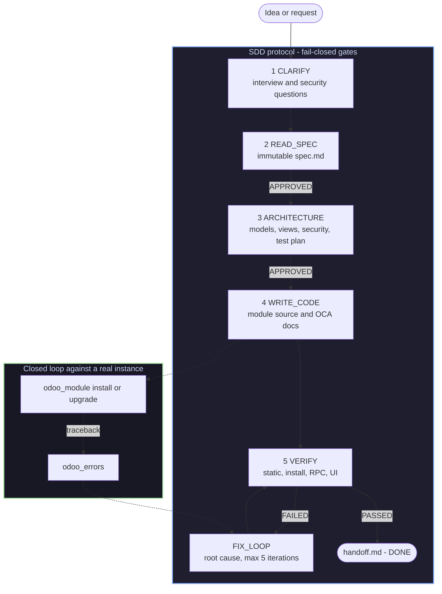
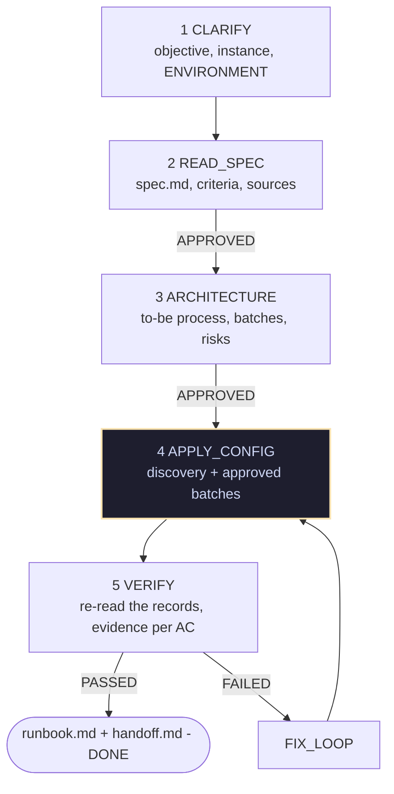
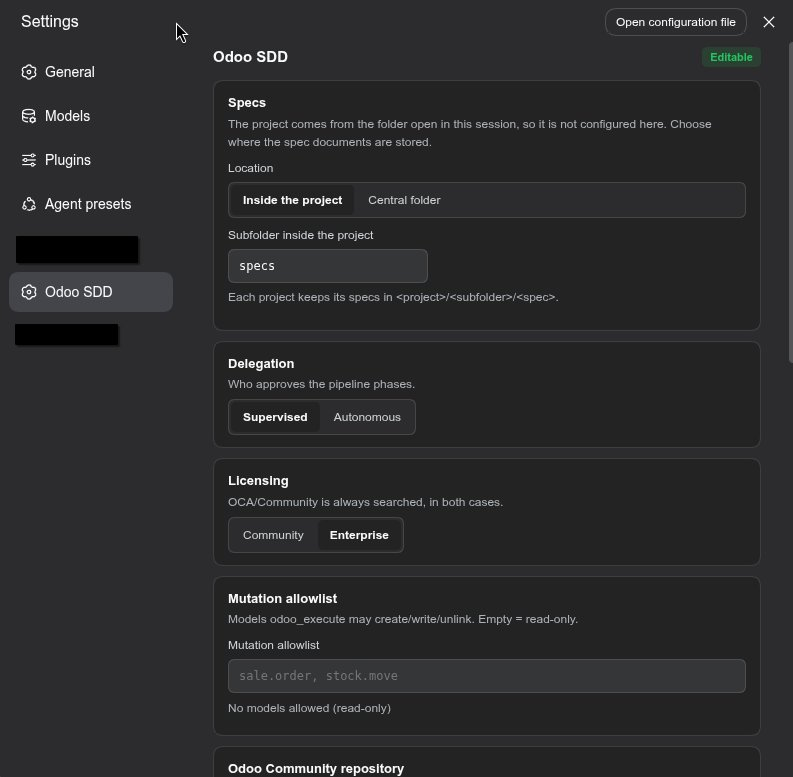

<p align="center">
  
</p>

# Spec-Driven Development for Odoo

<div align="center">

<h3>Turn DeepSeek Harness into a closed-loop Odoo workshop:<br/>spec → architecture → code → verify, against a real instance</h3>

<!-- The npm badges resolve against the published package. Update the owner/repo
     in the GitHub badges if this is ever forked elsewhere. -->
<p align="center">
  <a href="https://www.npmjs.com/package/dsh-odoo-sdd"></a>
  <a href="https://github.com/fhidalgodev/dsh-odoo-sdd/actions/workflows/ci.yml"></a>
  <a href="./LICENSE"></a>
  <a href="https://www.npmjs.com/package/dsh-odoo-sdd"></a>
  <a href="https://github.com/fhidalgodev/dsh-odoo-sdd/stargazers"></a>
  <a href="https://github.com/fhidalgodev/dsh-odoo-sdd/graphs/contributors"></a>
  <a href="https://github.com/fhidalgodev/dsh-odoo-sdd/discussions"></a>
</p>

<p align="center">
  <a href="README.md"><b>🇬🇧 English</b></a> &nbsp;•&nbsp;
  <a href="README.es.md"><b>🇪🇸 Español</b></a> &nbsp;•&nbsp;
  <a href="README.zh-CN.md"><b>🇨🇳 简体中文</b></a>
</p>

<p align="center">
  <b>Author:</b> <a href="https://github.com/fhidalgodev">Franyer Hidalgo</a> — <code>fhidalgo.dev@gmail.com</code>
</p>

<table align="center">
  <tr>
    <td align="center">
      ⭐ <strong>If this plugin saves you time, a star helps a lot</strong> — it is the signal that keeps the pipeline maintained.
      <br><br>
      🐛 <strong>Found a bug or want a feature?</strong> Open an issue in any language. Reproducible reports and honest "this did not work" notes are the most useful thing you can send.
    </td>
  </tr>
</table>

</div>

---

## ⚡ Summary

`dsh-odoo-sdd` turns **DeepSeek Harness** into a specification-driven (SDD)
Odoo development pipeline. Two ideas hold it together:

- **Closed feedback loop** — the agent installs and upgrades modules, reads the
  server traceback and retries against a **real, running** Odoo instance. The
  plugin never starts Docker or `odoo-bin`: you point it at an instance you
  already have (dev/staging) through a gitignored `.env`, and the tools speak
  plain JSON-RPC.
- **Pipeline safety** — every phase persists to disk, the gates are fail-closed
  on an explicit `APPROVED` marker, three consecutive failures force a
  root-cause diagnosis, verify/fix iterations are capped, `stop.md` halts
  everything, and verdicts are honest: a failed verification is persisted as
  FAILED and can never be reported as success.

> [!NOTE]
> **What it is not:** an infrastructure orchestrator, a credential manager over
> chat, or an auto-committer. It writes no commit and never asks you for a
> password.

### Requirements

| Need | Why |
|---|---|
| **DSH ≥ 0.1.2-rc.1** on **Node ≥ 20** | the plugin mounts as a Cordis bundle and uses the `tools` service |
| An **existing Odoo instance** reachable over HTTP(S) | the loop needs a real server to install into and read tracebacks from |
| A **disposable dev/staging database** | verification installs modules and writes test data |
| *(optional)* a **Playwright** browser tool | only for the UI layer of verification; without it those scenarios are marked for manual checking |

---

## 🔭 How it works



The specification is the single source of truth and it is **immutable**: the code
adapts to the spec, never the other way around. Gates are human-answered by
default, and can be delegated to a human-proxy agent when you choose the
autonomous mode.

---

## ✨ Key features

- 🎯 **Spec before code, always.** `spec.md` carries numbered acceptance criteria;
  `DONE` is unreachable without a persisted `PASSED` verdict on disk.
- 🔁 **A real feedback loop.** `odoo_module install` returns the server's own
  output or traceback; `odoo_errors` reads `ir.logging`; failures become a
  persisted FAILED verdict instead of a hopeful summary.
- 🧾 **Not only modules.** The same machine also runs a **functional** spec
  (`mode=functional`): configure a live instance and load data in
  human-approved batches, with Odoo's own importer for CSV/Excel, and close with
  a runbook a person can repeat. → [The functional path](#-the-functional-path-configure-and-import)
- 🔒 **Credentials are not consent.** The first socket of a project needs an
  explicit human authorization bound to `url + db + user` (`.sdd/grants.json`).
- ⏪ **Rollback that tells the truth.** Checkpoints snapshot files and journal
  every `odoo_execute` pre-image, and a restore always reports the files created
  after the checkpoint. What it cannot undo, it says so.
- 🧱 **Documentation as a gate.** `odoo_docs` produces the OCA `readme/`
  fragments, the Apps `index.html` and a mandatory changelog entry — and it
  works on an existing module with no spec, no phase and no instance.
- 🧪 **Instance-free static layers.** `odoo_validate` (structure + ACL coherence)
  and `odoo_security_scan` (raw SQL, `sudo()`, `auth="none"`, QWeb `t-raw`…)
  give findings with `file:line` before anything is installed.
- 🧑⚖️ **Policy the model cannot relax.** Allowlist, guards and delegation mode
  all require native human approval to change.
- 🤖 **Supervised or autonomous.** The same pipeline runs with a human answering
  each gate, or with a human-proxy agent and unattended goal rounds until `DONE`
  or `BLOCKED`.
- 📁 **Specs where you want them.** Keep them beside each project, or collect
  every project's specs in one folder you can search.
- 🖥️ **Linux, macOS and Windows.** Paths, atomic writes and `.env` permissions
  are handled per platform and tested on Windows in CI.

---

## 🚀 Quick start

### 1. Install into a profile

```bash
dsh plugin --profile web add dsh-odoo-sdd
```

That installs the **published package from the npm registry** — no clone, no
build, nothing to compile on your side. `dsh plugin` is a thin `pnpm` forwarder:
it runs `pnpm add` inside the profile directory and then registers the bundle
(`dsh.profile.bundles`). Two consequences worth knowing:

- **pnpm must be on your `PATH`** (`dsh plugin` reports it when it is not).
- Any pnpm spec works, so you can pin a version:
  `dsh plugin --profile web add dsh-odoo-sdd@0.1.1`.

Prefer plain npm — a project that depends on the plugin, or a CI job?

```bash
npm install dsh-odoo-sdd        # 0.1.1, published with a provenance attestation
```

> [!IMPORTANT]
> Restart DSH and refresh the browser tab after installing. Client-side changes
> (the **Odoo SDD** settings panel) load from the installed package.

**Working on the plugin itself?** Install the checkout instead. `lib/` is build
output and is **not** committed; `npm install` builds it through the `prepare`
hook, and you can always ask for it explicitly:

```bash
git clone https://github.com/fhidalgodev/dsh-odoo-sdd && cd dsh-odoo-sdd
npm install          # devDependencies: typescript, then prepare builds lib/
npm run host:deps    # optional peers, needed to compile (no-save)
npm run build        # emits lib/ — required, package main is lib/index.js
dsh plugin --profile odoo add .
```

> [!NOTE]
> A **git** install runs that `prepare` build on the consumer's machine, and pnpm
> blocks dependency build scripts until they are allowed: the command tells you
> the exact key to add under `allowBuilds` in the profile's
> `pnpm-workspace.yaml`. A registry install needs none of that — the tarball
> already ships `lib/`.

`dsh plugin add` records the bundle in the profile's `package.json`
(`dsh.profile.bundles`), and the package ships a Cordis patch
(`cordis.patch.yml`) that inserts its own row — so there is no manual
composition step. `dsh --profile <name> --dump-config` prints the composed tree
without booting anything.

### 2. Give it credentials (once per project)

Ask the agent to run `odoo_setup mode=check`. It writes a **secret-free**
scaffold and you fill the password yourself:

```text
odoo_setup mode=interactive url=http://localhost:8069 db=odoo_dev username=admin
# then fill ODOO_PASSWORD (an Odoo API key is recommended) in the printed file
odoo_setup mode=authorize   # asks YOU, once, to authorize that exact target
```

Or do it by hand — the plugin looks for the first of these that exists:

| # | Location | Scope |
|---|---|---|
| 1 | `ODOO_SDD_ENV_FILE` | explicit environment override |
| 2 | `<project>/.sdd/.env` | project scope, plugin-owned hidden dir |
| 3 | `~/.config/dsh-odoo-sdd/.env` (honors `$XDG_CONFIG_HOME`) | user scope — one set of dev credentials for every project |
| 4 | `<project>/.env` | legacy location, still supported (reported as legacy) |

```bash
mkdir -p ~/.config/dsh-odoo-sdd && cd ~/.config/dsh-odoo-sdd
cp <plugin>/.env.example .env && chmod 600 .env
# fill: ODOO_URL, ODOO_DB, ODOO_USERNAME, ODOO_PASSWORD
```

> [!WARNING]
> Never paste a password into the chat, a spec, a commit or an issue. The plugin
> refuses a group/world-readable `.env`, redacts the secret from every tool
> output, and stores session cookies in `.sdd/session.json` (mode 600) without
> ever returning them to the model.

### 3. Ask for the thing you want

```text
Implement a sale order approval module for Odoo 19, using the SDD workflow.
```

The agent picks up `odoo-sdd-workflow` from the session skill catalog and follows
the protocol. If you want to be explicit — or you want to be sure the full
instructions are loaded — start your message with `/odoo-sdd-workflow`.

For configuration and data work on a running instance, ask for that instead:

```text
Set up company, taxes and chart of accounts in my dev instance, then import
this customers.csv — functional SDD, dev environment, no production.
```

That selects `odoo-functional-sdd` (or `/odoo-functional-sdd` explicitly) and
the `functional` spec mode described below.

---

## 🧭 The five phases

| Phase | What happens | Gate to leave it |
|---|---|---|
| **CLARIFY** | Intent recorded (`mode` create/bug, `licensed`) and the security interview answered: groups, ACLs, record rules, `sudo()` justification, public routes | `sdd_phase clarify` |
| **READ_SPEC** | `spec.md` is assimilated: business context, numbered acceptance criteria, constraints, target Odoo version. **Writing code here is forbidden.** | `APPROVED` + `mark_spec_loaded` |
| **ARCHITECTURE** | Models, views (including extra view types and a search view where they matter), reports, security matrix and `test-plan.md` | `APPROVED` |
| **WRITE_CODE** | The module is implemented with version-pinned Odoo patterns and its OCA documentation | static gates green |
| **VERIFY** | Ascending pyramid: static → install/upgrade → RPC/data → UI (Playwright) only for critical flows | persisted `PASSED` verdict |
| **FIX_LOOP** | Root-cause fixes. 3 consecutive failures force a consultant diagnosis; 5 iterations force `BLOCKED` | honest verdict |

In ARCHITECTURE the agent also **asks** about the things that are cheap to decide
early and expensive to discover late: **extra view types** beyond form/tree
(including a **search view** for how a model is searched — custom filters,
favorites), **reports** (PDF via `ir.actions.report`/QWeb, SQL, CSV/XLSX, an
external tool), **web tours** (onboarding, test, or none — with the asset bundle
that loads them, because a tour no bundle loads never runs) and **demo data**
(which files, and what for). Each one is answered explicitly — "form + tree
only", "no reports needed", "no tours needed", "no demo data". Those are
**guide** decisions: recorded in `## Views` / `## Reports` / `## Tours` /
`## Demo data` and surfaced as warnings in `sdd_phase status`, non-blocking by
design — the security model is the only fail-closed content gate. The
version-by-version tour API, the `HttpCase` that executes a tour and the demo
traps live in `skills/odoo-sdd-workflow/references/tours-and-demo.md`.

Per-spec artifacts (all on disk, resumable):

```text
specs/<NNN>-<slug>/
├── spec.md · architecture.md · test-plan.md
├── verify-verdict.txt   # honest persisted verdict
├── state.json           # phase, failures, iterations
├── kb.json              # decisions, discarded options, blockers, diagnoses
├── docs-report.md · security-report.md
└── handoff.md           # written by sdd_handoff when the run closes
```

---

## 🧩 The functional path (configure and import)

Not every Odoo job is code. Setting up a company, its taxes, its users and its
master data is **configuration and data**, and it happens on a live instance —
where a wrong click is not a failed test but a real record. The same SDD machine
covers it with a different middle phase and stricter closing rules.



| | Development run | Functional run |
|---|---|---|
| Chosen at `CLARIFY` | `mode=create` or `mode=bug` | `mode=functional` |
| Middle phase | `WRITE_CODE` (module source) | `APPLY_CONFIG` (batches against the instance) |
| Deliverable | module + OCA docs | configured instance + `functional-runbook.md` |
| Skill | `odoo-sdd-workflow` | `odoo-functional-sdd` |

**How a change reaches the instance.** Nothing is written "to see what happens":

1. **Discovery first**, under its OWN approval: which models, which fields, how
   many records. Reads are not mutations, but an approved scope is what stops
   "just looking around" from turning into a change.
2. **Plan**: the design becomes batches. Each one declares its destination and
   environment, the version and capabilities used, company and context, the
   acceptance criteria it covers, its ordered operations, record identity,
   preconditions, expected result, risks, recovery and manual steps.
3. **Approve**: the human sees the exact batch and approves it through the native
   approval seam. The receipt is bound to the hashes of the spec, the design, the
   plan and the batch — change any of them and the approval is void.
4. **Apply**: one operation at a time, re-checking those hashes, persisting each
   operation's state *before* the call and *after* the result.
5. **An unknown outcome is not a retry.** A timeout after a mutation may mean
   Odoo already committed, so the operation is marked `indeterminate`, the batch
   stops and the run parks until a human reconciles it.
6. **Close honestly**: `sdd_phase succeed` demands an explicit `pass` per
   acceptance criterion, the security review is mandatory, and so is the
   **runbook** (who does it, in which company, prerequisites, the verified menu
   path, the steps with their field labels, the expected result, how to check it
   and how to undo it) — whatever the documentation policy says.

**The environment is declared, never assumed.** `ODOO_SDD_ENVIRONMENT` on the
target says `dev`, `staging` or `production`. A plan that declares a different
environment than the target is refused (`environment-mismatch`), an undeclared
target asks for it (`NEEDS_ENVIRONMENT`), and production additionally needs a
declared backup reference plus its own approval. High-risk changes are proven in
staging first.

**Imports go through Odoo's importer, never through a hand-written parser:**

```text
odoo_import use=prepare file=... model=res.partner   # uploads, with its own approval
odoo_import use=preview   ...                        # what ODOO read: sheets, headers, sample
odoo_import use=map       ...                        # one decision per column, no blanks
odoo_import use=plan      ...                        # becomes an `apply` batch
odoo_functional operation=approve / apply            # the batch path, unchanged
```

The version contract is explicit (majors 10–19: `file`/`import_id` + JSONP on the
old endpoint, `ufile`/`id` + JSON on the new one, `do`/`execute_import` for the
apply), and a version outside the verified families is **refused** with what to
investigate instead of guessed. A file that changed after the upload invalidates
the mapping; a `nextrow` in the answer means the importer stopped mid-file and is
reported as partial, never as success — and the rows it counted are never
re-sent. The session cookie stays in `.sdd/session.json` (mode 600) and out of
every tool result.

> [!NOTE]
> The functional path needs an instance, and the importer needs a web session:
> run `odoo_session` once before `odoo_import use=prepare`.

---

## 🧰 The 15 tools

| Tool | Purpose |
|---|---|
| `odoo_connect` | Probe the instance: server version + authentication. Masked report; distinguishes `NEEDS_SETUP` / `NEEDS_SECRET` / `DEFERRED` / `SKIPPED` states (never asks for secrets in chat). |
| `odoo_setup` | Onboarding: `check` (cascade + gitignore + delegation mode), `interactive` (secret-free chmod-600 scaffold), **`authorize`** (ask the DEVELOPER, through native approval, for a connection grant bound to the current url/db/user), **`revoke`** (drop the grants), **`purge`** (plan first, then — with `confirm_destructive=true` plus human approval — remove only the plugin's own state under `.sdd/`), `later`, `skip`, `reset`, `autonomy` (supervised \| autonomous, human-approved). Secrets are never accepted as parameters. |
| `odoo_module` | `info` / `install` / `upgrade` on `ir.module.module` (`button_immediate_*`). Returns the server's own output or traceback, redacted — the closed feedback loop. |
| `odoo_execute` | Generic CRUD/RPC (`execute_kw`) with a fail-closed allowlist. Methods are classified explicitly and an unclassified one is refused: reads (`search_read`, `read`, `search_count`, `read_group`, `fields_get`) are allowed, with `fields`/`limit`/`order`/`offset` for projection and paging (a fractional or negative `offset` is refused, never clamped); mutations (`create`/`write`/`unlink`) require `confirm_destructive=true` AND the model in `executeAllowlist`, and are journaled so the data undo can replay them. `context` is forwarded verbatim — use `allowed_company_ids`/`company_id` on multi-company instances — and the server still applies its own ACL. No instance needed to evaluate denials. |
| `odoo_validate` | LOCAL, instance-free module structure check: `__manifest__.py` present + depends, declared data XML files exist, `security/ir.model.access.csv` when models are declared. Returns file:line findings plus the `module_dir` and project root it resolved (a relative path resolves against the session's folder, never the process cwd). |
| `odoo_errors` | Reads recent `ir.logging` server errors — the remote equivalent of fetching environment logs. |
| `odoo_session` | Mints a passwordless web session (the `connect_as_user` pattern) stored in `.sdd/session.json` (chmod 600) for Playwright UI tests. The cookie itself is never returned. |
| `sdd_phase` | The phase state machine: `init`, `status` (logbook summary, spec directory and specs location), `mark_spec_loaded`, `advance` (fail-closed gates + `approval_source` provenance), `fail` (failure ladder + FAILED verdict), `succeed` (PASSED verdict; refused unless every AC row in `test-plan.md` reads an explicit `pass`), `rollback` (restore a checkpoint and return to WRITE_CODE), `diagnose`. |
| `sdd_checkpoint` | The rollback surface: `create` (snapshots the workspace, becomes the active checkpoint), `list`, `restore` (files, plus — with `restore_data=true` and `confirm_destructive=true` — the journaled data mutations: the undo runs under the company context the mutation used, turns read shapes into write values, marks each op so a retry never compensates it twice, refuses a journal from another destination, and reports every field it could not restore; it always REPORTS files created after the checkpoint and deletes them only with `remove_created=true`), `drop`, `journal`. |
| `odoo_docs` | Documentation for a module, usable **on its own** (no spec, phase, checkpoint or instance), so an existing module can simply be documented: `check` (OCA fragments mapped to Diátaxis, version scheme, changelog, `index.html`, docstrings, xpath comments, OWL directives → ERROR/WARN with `file:line`), `plan`, `scaffold` (create-only skeletons, never overwrites) and `report` (persists `docs-report.md`; APPROVED only when nothing is still a scaffold). The changelog entry is mandatory for any change to a released module. |
| `odoo_security_scan` | Local static security review (no instance needed): raw SQL by concatenation, `eval`/`exec`/`pickle`, hardcoded secrets, unjustified `sudo()`, `auth="none"`, disabled CSRF, QWeb `t-raw`. Findings carry `file:line` + a fix hint; any ERROR blocks `DONE`. |
| `sdd_handoff` | Writes `specs/<id>/handoff.md` (final phase, verdict, decisions, blockers, checkpoints, the COMPLETE per-spec data journal, effective config, next steps) when the run closes. |
| `odoo_config` | Reads or updates the persistent configuration and answers **"which project am I in?"**: the resolved root, its provenance (session cwd / configured / process cwd), the specs base, the effective spec directory and the config file in use. |
| `odoo_import` | Preparation of a CSV/XLS/XLSX import through Odoo's OWN importer (`base_import`), never through a parser of this plugin: `prepare` uploads the authorised file with the web session and its own approval, `preview` reports what Odoo reads (sheets, headers, a bounded sample, the importable fields), `map` records a decision per column, `plan` turns it into an `apply` batch — and `odoo_functional` approves and executes it like any other, so this tool never applies an import on its own. A JSONP answer is parsed as data (never executed), the session cookie never leaves the plugin, and a version outside the verified families is refused with what to investigate. |
| `odoo_functional` | The batch executor of the functional path: `plan` (validate and store a batch fail-closed), `approve` (native human approval bound to the spec, design, plan and batch hashes), `apply` (execute it one operation at a time, persisting each state before and after the call), `inspect` (read-only discovery under its own scope), `status`, `reconcile` (decide an outcome that came back as unknown), `verify` (evidence per acceptance criterion) and `compensate` (build the undo batch from the journal). The declared environment gates the run and production additionally needs a declared backup; while a batch runs, every other mutation path is denied. |

---

## 🎛️ Delegation mode

The pipeline starts by asking how much of it to delegate — recorded once per
project with `odoo_setup mode=autonomy decision=...`:

| Mode | Who answers the gates | How it ends |
|---|---|---|
| **Supervised** (default) | you, for each gated phase | you approve, or the run parks |
| **Autonomous** | a **human-proxy** agent (`agents/human-proxy.md`) that emits only a fail-closed line-start `APPROVED` or `NEEDS_REVISION` | `create_goal` runs unattended rounds until `DONE` or `BLOCKED` |

> [!TIP]
> In autonomous mode the brakes stay armed: `stop.md`, the iteration ceiling and
> the diagnosis ladder all remain, and `BLOCKED` is the only way the run pages a
> human. Connection grants are *not* covered by the switch — a human still
> authorizes the instance once.

---

## 🧠 Context engineering layers

| Layer | Component |
|---|---|
| **identity** | `agents/*.md` — architect, developer, qa, consultant, human-proxy, security-reviewer, documentation personas with role + limits |
| **odoo_connection** | `odoo-client.ts` — JSON-RPC auth, `execute_kw`, session minting |
| **executors** | `odoo_module`, `odoo_execute`, `odoo_validate`, `odoo_errors` |
| **schemas** | staged templates with required sections; `transition()` rejects a phase whose deliverable lacks them |
| **knowledge** | version-pinned Odoo pattern skills (delegated, verified by the skill) |
| **skills** | `SKILL.md` — the 5-phase orchestration flow, auto-registered with the host on `apply()` |
| **logbook** | `kb.json` — decisions, discarded options, blockers; read before proposing |
| **audit** | `.sdd/audit.jsonl` — sanitized append-only tool-activity log, written by a global `tools/result` listener (not just the Odoo tools) |
| **rollback** | `.sdd/checkpoints/<id>/` — manifest + file snapshot + data journal, restorable per spec |
| **security** | `odoo_security_scan` rules + the `security-reviewer` persona + the mandatory security interview in CLARIFY |
| **test** | `tests/smoke.mjs` — instance-free invariant suite (state machine, security, policy guard, RPC shapes, root/specs layout, real-Cordis host contract) + `tests/client.mjs` — browser bundle contract and settings-panel render |

---

## 🛡️ Safety, rollback and traceability

The pipeline assumes the agent will eventually be wrong, so every mutation path
has a way back and a way to prove what happened.

- **Credentials are not consent.** Before any tool opens a socket towards the
  instance, a HUMAN must have approved that exact target. `odoo_setup
  mode=authorize` asks through the host's native approval seam and only the
  `allowed-once` outcome stores a receipt in `.sdd/grants.json` (0600,
  gitignored). The receipt is bound to a fingerprint of `url + db + username`,
  so changing any of them invalidates it; `mode=revoke` drops it. Without a live
  receipt, no client is handed out at all, so a configured `.env` cannot be used
  silently. In AUTONOMOUS mode there are no answerers, so the run reports
  `NOT AUTHORIZED` and parks — which is the point.
- **The model cannot relax its own policy.** Changing the allowlist or the policy
  guards (`odoo_config mode=set`) and switching delegation mode
  (`odoo_setup mode=autonomy`) each require a native approval.
- **Checkpoint before mutating.** With `requireCheckpointBeforeMutation` on
  (default), `odoo_execute` mutations are denied until `sdd_checkpoint create`
  has snapshotted the active spec — and denied outright before `WRITE_CODE`.
  Snapshots skip symlinks (`lstat`) and never copy `.env` or key material.
- **Fail-closed guard.** An internal guard failure denies with a visible reason
  instead of allowing the call through.
- **File rollback.** `sdd_checkpoint restore` puts the snapshotted files back
  byte-for-byte; `sdd_phase rollback` returns the spec to `WRITE_CODE` with the
  failure recorded, so the loop restarts from a known state. A checkpoint
  snapshots the project tree, so with the **central** specs layout the spec
  documents (which live outside the project) are deliberately not part of it:
  the spec is the immutable source of truth, not code to roll back.
- **Data rollback (best effort, and honest about it).** Every
  `create`/`write`/`unlink` through `odoo_execute` records its pre-image in the
  checkpoint journal, stamped with the database **and** the destination
  (url+db+user) it was applied to; `restore restore_data=true
  confirm_destructive=true` replays it in reverse and refuses a journal from
  another destination. The replay runs under the company context the mutation
  used, converts read shapes into write values (many2one, x2many), marks each
  operation as it is compensated so a retry never repeats one, and reports the
  fields it could not restore (binary content, read-only or non-stored fields).
  Re-created records get NEW ids — the report says so. This covers data written
  through the plugin — **not** side effects of a module install/upgrade, which
  are not reverted at database level.
- **Restore reports drift.** `restore` always lists the files created *after* the
  checkpoint, so nothing is silently left behind; `remove_created=true` deletes
  them (inside the snapshotted roots only) to match the snapshot exactly.
- **Documentation is a gate, not a footnote.** ARCHITECTURE records the decision
  in `## Documentation`, WRITE_CODE produces the OCA fragments + the Apps
  `index.html` + the mandatory changelog entry, and `DONE` is gated by
  `documentationPolicy` (`required` by default; `optional` and `off` available).
  What the plugin cannot do, it says so: `gen-odoo-readme`, `towncrier`, Ruff and
  pylint need a shell, so the fragments are the source of truth and compiling
  `README.rst` stays your step.
- **Lifecycle: the plugin owns its state and can give it back.** `odoo_setup
  mode=purge` prints a plan (what it owns and what it deliberately keeps) and
  deletes only after `confirm_destructive=true` plus native human approval. It
  never touches `.env` (your credentials), `stop.md` (your brake) or `specs/`
  (your documents).
- **Durable state.** Pipeline state, KB, verdicts, grants and the journal are
  written with an atomic replace, and a corrupt file is quarantined next to the
  original instead of being overwritten: `sdd_phase status` reports the recovery.
- **Traceability.** `.sdd/audit.jsonl` records every tool call with outcome
  (`ok` / `error` / `denied`), duration and phase; `sdd_phase status` prints the
  logbook; `sdd_handoff` freezes the whole run into `handoff.md`.
- **Emergency brakes.** `stop.md` (at `.sdd/stop.md` or `specs/<active>/stop.md`)
  halts every tool; iteration ceilings and the diagnosis ladder route to
  `BLOCKED` instead of looping forever.

---

## 🔐 Security & network posture

- **No phone-home.** The plugin's ONLY outbound network calls go to the instance
  URL you put in `.env`. No telemetry, no update checks, no third-party
  endpoints.
- **Transport guard (fail-closed).** `http://` is accepted only for loopback
  hosts (`localhost`, `127.x`, `::1`, `*.localhost`); anything else must be
  `https://`, otherwise credential loading is refused — plain http to a remote
  host would ship the API key in clear text.
- **Secret containment.** The secret is read once by `credentials.ts` and only
  injected into RPC parameters. Every tool output passes through two-layer
  redaction (known secret + generic `password=` / `Bearer` / `api_key=` /
  `session_id` shapes) and home-path masking (`/home/user/…` → `~/…`) before
  being shown to the model or persisted to the KB.
- **Session cookies never reach the model.** `odoo_session` writes the cookie to
  `.sdd/session.json` (chmod 600) and returns only the path.
- **No install scripts beyond the build.** The only lifecycle scripts are
  `prepare`/`prepack`, which compile `src/` into the shipped `lib/` and do
  nothing else — no network, no `postinstall`, no shell. The two have opposite
  failure policies on purpose: **`prepare` (which runs on an install) never
  fails one** — without the devDependencies or the optional host peers it says
  what it could not check and emits without type checking so the plugin still
  loads — while **`prepack` (which runs on a publish) refuses to package a build
  it could not typecheck**. `prepack` is also what guarantees a published tarball
  is never missing the entry point its `main` promises (that failure was real: a
  clean clone packed 39 files and zero of them under `lib/`; so was its sequel,
  a `prepare` that typechecked during `npm install` and failed every CI job
  before the step that installs those peers could run).
- **Host requirement declared twice**, following dsh-market discovery
  conventions: `engines.dsh` and lockstep optional peer ranges on
  `@deepseek-ai/{cordis,dsh-tools,schemastery}`. On a host without the `tools`
  service the plugin refuses to mount with an explicit error instead of booting
  broken.

---

## 🖥️ Platform support

The plugin runs wherever DSH does and claims **Linux, macOS and Windows** — a
claim the CI matrix tests rather than asserts (`ubuntu-latest` **and**
`windows-latest`, on Node 20 and 22).

| Concern | Behaviour |
|---|---|
| Paths | `module_dir` and an explicit root accept POSIX (`/opt/odoo`) and Windows (`C:\odoo`, UNC) spellings; an absolute path is never concatenated under the project root. |
| `.env` permissions | Owner-only (0600) is requested and **re-checked after `chmod`**: on a filesystem that cannot express mode bits (Windows, FAT/exFAT, some mounts) the plugin says "owner-only mode requested" and adds a note instead of pretending the file is private. On a real POSIX filesystem, a loose mode that cannot be tightened is still refused. |
| Atomic writes | State files are written to a sibling temp file and renamed into place, retrying `EPERM`/`EACCES`/`EBUSY` with a bounded backoff — the case where Windows refuses the rename because an editor, indexer or antivirus holds an open handle. |
| Project root | Resolved per call from the **session's folder**; the process cwd is only a last resort and is reported as `LAST RESORT`. |
| Symlinks | A checkpoint never follows a symlink out of the tree; the test suite skips its symlink assertions where the OS or the user privileges forbid creating one — and says so instead of passing silently. |

### 📁 Where specs live

The project root is the folder open in the current session, so it is not a
plugin-wide setting. Spec documents follow it:

| Layout | Path | Pick it when |
|---|---|---|
| **project** (default) | `<projectRoot>/<specsDir>/<specId>` | specs should travel with the code |
| **central** | `<specsRoot>/<projectSlug>/<specId>` | you keep many module repos and want one searchable place |

In the central layout each project gets its own subfolder with a
`.dsh-project-root` marker, plus a hash suffix if two projects share a directory
name — a foreign folder is never adopted. `.sdd/` always stays with the project.

```text
<projectRoot>/
├── .sdd/                       # plugin-owned, gitignored
│   ├── .env                    # credentials (chmod 600)
│   ├── config.json             # project configuration
│   ├── grants.json             # human authorization receipts
│   ├── session.json            # Playwright cookie
│   ├── audit.jsonl             # every tool call, sanitized
│   ├── setup-state.json        # onboarding + delegation decision
│   ├── active.json             # active spec, phase, checkpoint
│   └── checkpoints/<id>/       # manifest + file snapshot + data journal
└── specs/<NNN>-<slug>/         # or the central folder
```

> [!TIP]
> With several projects open, read the `Project root: … [provenance]` line that
> every tool result carries, or ask `odoo_config mode=read` — it returns the
> resolved root, its provenance and the effective spec directory.

---

## ⚙️ Configuration

Open **Settings → Odoo SDD** in the Web UI. Everything is editable there, plus a
few copy-paste presets where you need them.

<p align="center">
  
</p>

```yaml
# ~/.dsh/profiles/<profile>/cordis.patch.yml (optional: same fields, as a patch)
- insert:
    - id: odoo-sdd
      config:
        specsMode: project      # project | central
        specsRoot: ''           # absolute folder when specsMode=central
        specsDir: specs         # folder inside the project when specsMode=project
        executeAllowlist: []    # models odoo_execute may create/write/unlink
        communityRepoUrl: https://github.com/odoo/odoo
        enterpriseRepoUrl: https://github.com/odoo/enterprise
        autonomy: supervised    # supervised | autonomous
        licensed: community     # community | enterprise (OCA is always searched)
        requireCheckpointBeforeMutation: true
        securityReviewRequired: true
        securityInterviewRequired: true
        auditAllTools: true
        maxCheckpoints: 5
        documentationPolicy: required   # required | optional | off
        documentationLanguage: ''       # empty = English unless the project says otherwise
```

> [!IMPORTANT]
> There are two configuration stores, and the more specific one wins:
> **Settings** (user-wide, `~/.dsh/settings.yaml`) and the project's
> **`.sdd/config.json`** (written by `odoo_config mode=set`, per project). If a
> key looks ignored after you change it in the panel, the project file is
> pinning it — `odoo_config mode=read` reports the effective values.

---

## 🤖 Model experience

The agent sees 13 tools with self-contained descriptions. Typical flow:
`sdd_phase init` → security interview + `odoo_connect` → gated phases with
`APPROVED` → `sdd_checkpoint create` → code → `odoo_security_scan` →
`odoo_module install` → on traceback, `odoo_errors` + `sdd_phase fail` (which may
force a diagnosis) → fix (or `sdd_phase rollback`) → re-verify →
`sdd_phase succeed` → `sdd_handoff` → `DONE`. Tool responses are actionable text:
server tracebacks, gate rejection reasons and remediation instructions.

The workflow skill is registered at mount time, so its **name and description**
appear in every session's skill catalog automatically. The full instructions load
when the model selects it (the catalog is summaries only) or when you type
`/odoo-sdd-workflow`.

---

## ⚠️ Known limitations and deferred work

- **Remote tests** — without shell access to the instance there is no way to run
  `--test-enable`; the second verification layer is RPC/UI testing. Pending: an
  optional `odoo_run_tests` tool if you expose a test runner.
- **Data rollback is best effort** — the tests write to the connected database and
  there is no ephemeral cloning (by design: you provision and own the target).
  `sdd_checkpoint` reverses data written through `odoo_execute`, but a module
  install/upgrade is **not** reverted at database level. Use a disposable
  database.
- **Static security scan scope** — `odoo_security_scan` is rule-based over source
  text (no AST, no taint tracking), so it catches the common Odoo mistakes, not
  everything; it complements a human review, never replaces it.
- **Multi-instance** — one target per project (`.env`). Pending: named instance
  profiles (`dev`, `staging`).
- **Panel fields that are informational** — `autonomy` and
  `securityInterviewRequired` are stored and reported, but the pipeline reads the
  delegation decision from `.sdd/setup-state.json` (set with `odoo_setup
  mode=autonomy`) and enforces the security interview through the ARCHITECTURE
  content gate. Tracked as pending work.
- **No rich UI renderer** — tool output is text in the DSH web GUI.

---

## ❓ Troubleshooting

| Symptom | What it means | What to do |
|---|---|---|
| `NOT CONFIGURED` | no usable `.env` in the cascade | `odoo_setup mode=interactive` |
| `NEEDS_SECRET` | the scaffold exists but `ODOO_PASSWORD` is empty | fill it in the file, never in chat |
| `NOT AUTHORIZED` | credentials exist, no live human grant for this target | `odoo_setup mode=authorize` |
| `Instance unreachable` | version probe failed | check the URL/port and that the instance is running |
| Mutations always denied | no checkpoint, or the spec is not in `WRITE_CODE` yet | approve the gates, then `sdd_checkpoint create` |
| Everything is halted | `stop.md` exists | read it, then remove it |
| A panel change seems ignored | the project's `.sdd/config.json` outranks the global Settings layer | `odoo_config mode=read` shows the effective values |
| A spec directory "cannot be found" | you are in a different project folder | open that project's folder in a session |

---

## 🧩 Implementation internals

<details>
<summary>Plugin shape, source map and security decisions — click to expand</summary>

### Plugin shape

Follows the DSH tool-plugin convention (`dsh-tool-todo`, `dsh-tool-goal`): named
exports `name`, `inject`, `Config` (schemastery schema) and `apply(ctx, config)`,
registering each tool with `defineTool` from `@deepseek-ai/dsh-tools`. The
browser half is a plain JS ModuleLoader bundle that contributes the **Odoo SDD**
settings section.

### Source map

| File | Role |
|---|---|
| `src/index.ts` | Plugin entry: registration of the 13 tools, config resolution and the policy guard |
| `src/types.ts` | Public payload types (never contain secret material) |
| `src/credentials.ts` | Credential cascade, `.env` load/validation, permission verification, `redact()`, fail-closed |
| `src/odoo-client.ts` | JSON-RPC client: `common.version`, `authenticate`, `execute_kw`, `button_immediate_*`, `ir.logging`, `/web/session/authenticate` |
| `src/tools-runtime.ts` | Odoo-facing tool bodies: `odoo_execute` (allowlist + pre-image capture), `odoo_validate`, `odoo_module`, `odoo_errors` |
| `src/sdd-state.ts` | Phase machine, gates, append-only KB, verdicts, security content gate, `stop.md` |
| `src/checkpoints.ts` | Checkpoint store: manifest, file snapshot/restore, data journal, purge budget |
| `src/security-scan.ts` | Instance-free static security rules (`scanModule`) with `file:line` findings |
| `src/audit.ts` | Sanitized append-only audit log (`.sdd/audit.jsonl`) and the `withAudit` wrapper |
| `src/setup-state.ts` | Onboarding decision + delegation mode persistence (`.sdd/setup-state.json`) |
| `src/grants.ts` | Human authorization receipts (`.sdd/grants.json`), fingerprint-bound and fail-closed |
| `src/atomic.ts` | Atomic writes (bounded retry on `EPERM`/`EACCES`/`EBUSY`) and corruption quarantine + recovery reporting |
| `src/paths.ts` | Cross-platform `module_dir` resolution |
| `src/specs-location.ts` | Where specs live: project vs central layout, session-root resolution with provenance, slug/marker/collision handling |
| `src/lifecycle.ts` | Ownership inventory and the `purge` primitive (own state only; never `.env`/`stop.md`/`specs/`) |
| `src/docs-scan.ts` | Documentation rules: OCA fragments + Diátaxis, version scheme, changelog, index.html, docstrings, xpath, OWL |
| `src/docs-tool.ts` | The `odoo_docs` tool (check/plan/scaffold/report), usable without the pipeline |
| `src/project-conventions.ts` | Resolves the documentation language from the project's own rules, defaulting to English |

### Security decisions

- The secret only exists inside `credentials.ts` and the RPC call parameters;
  every output passes through `redact()` (including `user:pass@` URL shapes).
- The transport guard rejects anything that is neither HTTPS nor loopback before
  authenticating.
- Mutations are fail-closed twice over: the allowlist is read live on every call,
  and the policy guard denies `create`/`write`/`unlink` unless a checkpoint
  exists and the spec is in `WRITE_CODE` or later.
- Secrets are never accepted as tool parameters, never written to the audit log,
  and never requested through chat.
- Corrupted state ⇒ restart (progress is never faked); ambiguous gate ⇒
  rejection; absent verification ⇒ `DONE` unreachable; security gap ⇒
  ARCHITECTURE gate rejected.

### Build and test

```bash
npm run typecheck   # tsc --noEmit
npm run build       # emits lib/ (required: package main is lib/index.js)
npm test            # server invariants + Cordis host contract + client bundle + README + functional/import
npm run test:package  # tarball contents (a file the runtime loads but `files` omits)
```

These are exactly the steps [CI](.github/workflows/ci.yml) runs on Linux and
Windows, so a local `npm run typecheck && npm test` reproduces the pipeline.

`test:package` also **simulates the publish**: it copies the package without
`lib/` (what a fresh clone has), runs `npm pack` on it and asserts the tarball
still contains the compiled entry point. That is the check that keeps a released
version from being installable-but-unloadable. It then simulates the **install**
side — a tree with the compiler but without the optional host peers, which is
exactly CI's `npm install` — and asserts that `prepare` exits 0 there while
`prepack` refuses.

### Publishing (maintainers)

**npm does not follow GitHub.** They are two independent registries: a push, a tag
or a GitHub Release updates GitHub and nothing else, and `npm publish` updates npm
and nothing else. A published version is **immutable** — it cannot be overwritten,
only superseded — so `package.json` is bumped for every release.

`lib/` is build output and is gitignored, so the tarball is built by the `prepack`
hook — never by hand, never from a stale tree. The **first** publication is manual
(npm only lets you register a trusted publisher for a package that already
exists):

```bash
npm login                 # once; then `npm whoami` should answer
npm publish               # prepack runs `tsc` and packs the result
npm view dsh-odoo-sdd version   # verify what the registry actually has
```

After that, [`.github/workflows/publish.yml`](.github/workflows/publish.yml) does
it: **publishing a GitHub Release** (or a manual *workflow_dispatch*) runs the
same gates as CI — typecheck, build, tests, the publish simulation — checks that
the release tag matches `package.json`, refuses a version that is already on the
registry, and publishes with **provenance** through npm's OIDC **trusted
publishing**, so no `NPM_TOKEN` lives in this repository.

One-time setup for that automation: on npmjs.com → the package → *Settings* →
*Trusted publishers* → *Add* → provider **GitHub Actions**, owner `fhidalgodev`,
repository `dsh-odoo-sdd`, workflow filename `publish.yml`, environment **blank**
(a mismatch is a `403 npm-trusted-publisher-not-configured`). Prefer a token?
Create a granular access token with *bypass 2FA* and store it as the `NPM_TOKEN`
secret — the workflow says where.

So a release is: bump the version → merge → publish the Release, and the tag, the
Release and the npm version end up agreeing.

The same hooks make a repository install work: `prepare` compiles the sources
when TypeScript is present (`npm i github:fhidalgodev/dsh-odoo-sdd`), and skips
with a notice when it is not (a `file:` install has no devDependencies).

</details>

---

## ⭐ Star History

<a href="https://www.star-history.com/?repos=fhidalgodev%2Fdsh-odoo-sdd&type=date&legend=top-left">
  
</a>

> Chart generated live by the [star-history.com](https://star-history.com) API.

## 🙏 Acknowledgments

Built for the Odoo developer community, this plugin rests on two ecosystems:

- **[Odoo Community Association (OCA)](https://github.com/OCA)** — the coding
  conventions, module layout and quality gates this pipeline enforces.
- **[DeepSeek Harness (DSH)](https://github.com/deepseek-ai)** — the plugin
  architecture (Cordis tools/plugins, skills, subagents) this plugin runs on.

Thank you to everyone who contributes patterns, reviews and ideas that shape the
SDD workflow. Contributors:

<p align="center">
  <a href="https://github.com/fhidalgodev/dsh-odoo-sdd/graphs/contributors">
    
  </a>
</p>

---

## 📜 License

MIT © [Franyer Hidalgo](https://github.com/fhidalgodev)
