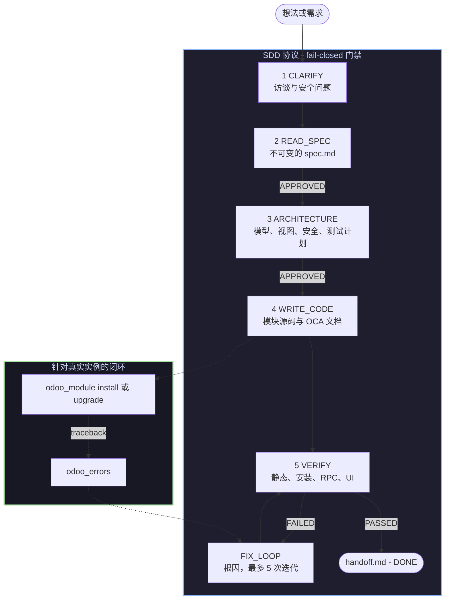
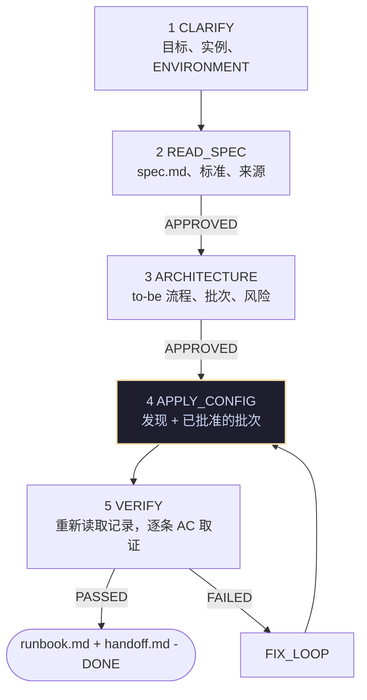

<p align="center">
  
</p>

# 面向 Odoo 的规范驱动开发

<div align="center">

<h3>把 DeepSeek Harness 变成一个闭环的 Odoo 工坊：<br/>spec → 架构 → 代码 → 验证，全程面对真实实例</h3>

<!-- npm 徽章指向已发布的包。如果这个项目被 fork 到别处，
     请更新 GitHub 徽章里的 owner/repo。 -->
<p align="center">
  <a href="https://www.npmjs.com/package/dsh-odoo-sdd"></a>
  <a href="https://github.com/fhidalgodev/dsh-odoo-sdd/actions/workflows/ci.yml"></a>
  <a href="./LICENSE"></a>
  <a href="https://www.npmjs.com/package/dsh-odoo-sdd"></a>
  <a href="https://github.com/fhidalgodev/dsh-odoo-sdd/stargazers"></a>
  <a href="https://github.com/fhidalgodev/dsh-odoo-sdd/graphs/contributors"></a>
  <a href="https://github.com/fhidalgodev/dsh-odoo-sdd/discussions"></a>
</p>

<p align="center">
  <a href="README.md"><b>🇬🇧 English</b></a> &nbsp;•&nbsp;
  <a href="README.es.md"><b>🇪🇸 Español</b></a> &nbsp;•&nbsp;
  <a href="README.zh-CN.md"><b>🇨🇳 简体中文</b></a>
</p>

<p align="center">
  <b>作者：</b> <a href="https://github.com/fhidalgodev">Franyer Hidalgo</a> — <code>fhidalgo.dev@gmail.com</code>
</p>

<table align="center">
  <tr>
    <td align="center">
      ⭐ <strong>如果这个插件帮你省下了时间，一颗 star 就是很大的帮助</strong> — 它是让这条流水线持续维护下去的信号。
      <br><br>
      🐛 <strong>发现了 bug，或者想要某个功能？</strong> 用任何语言提 issue 都可以。可复现的报告，以及诚实的"这个不管用"的说明，是你最有价值的反馈。
    </td>
  </tr>
</table>

</div>

---

## ⚡ 概述

`dsh-odoo-sdd` 把 **DeepSeek Harness** 变成一条规范驱动（SDD）的 Odoo
开发流水线。有两个理念把它撑起来：

- **闭环反馈** —— agent 会安装和升级模块、读取服务器 traceback，并针对一个
  **真实运行中**的 Odoo 实例重试。插件从不启动 Docker 或 `odoo-bin`：你通过一个
  被 gitignore 的 `.env` 把它指向你已有的实例（dev/staging），工具之间只说
  标准 JSON-RPC。
- **流水线安全** —— 每个阶段都持久化到磁盘，门禁在缺少显式 `APPROVED` 标记时
  fail-closed，连续三次失败会强制做根因诊断，verify/fix 迭代次数有上限，
  `stop.md` 会中止一切，而且结论是诚实的：失败的验证会持久化为 FAILED，
  永远不可能被报告成成功。
- **没有 spec 就没有变更** —— 在流水线关闭*之后*才到来的请求是一次新的变更，
  哪怕它出现在同一个对话里（"顺便把 X 也改了"）：它要么得到自己的（小份）spec，
  要么得到你显式的 waive。这道守卫对实例变更和源码编辑一视同仁，并且会说明三条
  出路里哪一条可用，而不是悄悄改掉。

> [!NOTE]
> **它不是什么：** 不是基础设施编排器，不是通过聊天管理凭据的管家，也不是
> 自动提交器。它不写任何 commit，也从不向你索要密码。

### 环境要求

| 需求 | 原因 |
|---|---|
| **DSH ≥ 0.1.2-rc.1**，运行在 **Node ≥ 20** 上 | 插件以 Cordis bundle 的形式挂载，并使用 `tools` 服务 |
| 一个可通过 HTTP(S) 访问的**现有 Odoo 实例** | 闭环需要一台真实服务器来安装模块并读取 traceback |
| 一个**可丢弃的 dev/staging 数据库** | 验证过程会安装模块并写入测试数据 |
| *（可选）* 一个 **Playwright** 浏览器工具 | 仅用于验证的 UI 层；没有它时，这些场景会被标记为需要人工检查 |

---

## 🔭 工作原理



规范是唯一的真相来源，而且它**不可变**：代码去适应 spec，绝不反过来。门禁默认由
人来回答；当你选择自主模式时，也可以把它们委派给一个人工代理 agent。

---

## ✨ 核心特性

- 🎯 **永远先有 spec，再写代码。** `spec.md` 携带编号的验收标准；磁盘上没有
  持久化的 `PASSED` 结论，就永远到不了 `DONE`。
- 🔁 **真实的反馈闭环。** `odoo_module install` 返回服务器自己的输出或
  traceback；`odoo_errors` 读取 `ir.logging`；失败会变成一个持久化的 FAILED
  结论，而不是一份乐观的总结。
- 🧾 **不只是模块。** 同一套机器也会跑**功能型** spec（`mode=functional`）：
  配置一个在线实例，并以人工批准的批次加载数据，CSV/Excel 走 Odoo 自己的
  导入器，最后用一份别人能照着复现的 runbook 收尾。
  → [功能路径](#-功能路径配置与导入)
- 🔒 **有凭据不等于有授权。** 一个项目打开第一个 socket 之前，需要一份绑定
  `url + db + user` 的显式人工授权（`.sdd/grants.json`）。
- ⏪ **说真话的回滚。** checkpoint 会快照文件，并记录每一次 `odoo_execute`
  的前像；restore 总会报告 checkpoint 之后创建的文件。撤销不了的东西，它会直说。
- 🧱 **文档也是门禁。** `odoo_docs` 产出 OCA 的 `readme/` 片段、Apps 的
  `index.html` 和强制的 changelog 条目 —— 而且它对一个没有 spec、没有阶段、
  没有实例的已有模块同样可用。
- 🧪 **无需实例的静态层。** `odoo_validate`（结构 + ACL 一致性）和
  `odoo_security_scan`（原生 SQL、`sudo()`、`auth="none"`、QWeb `t-raw`……）
  在任何东西被安装之前就给出带 `file:line` 的发现。
- 🧑⚖️ **模型无法自行放松的策略。** 白名单、守卫和委派模式，任何改动都需要
  原生人工批准。
- 🤖 **受监督或自主。** 同一条流水线，可以由人逐个回答门禁，也可以由人工代理
  agent 无人值守地跑 goal 轮次，直到 `DONE` 或 `BLOCKED`。
- 📁 **spec 放在你想要的地方。** 放在每个项目旁边，或者把每个项目的 spec
  收集到一个可搜索的文件夹里。
- 🖥️ **Linux、macOS 和 Windows。** 路径、原子写入和 `.env` 权限都按平台处理，
  并在 CI 的 Windows 上测试。

---

## 🚀 快速开始

### 1. 安装到 profile

```bash
dsh plugin --profile web add dsh-odoo-sdd
```

那会从 **npm registry 安装已发布的包** —— 不用 clone，不用 build，你这边没有
任何要编译的东西。`dsh plugin` 是一个很薄的 `pnpm` 转发器：它在 profile 目录里
运行 `pnpm add`，然后注册 bundle（`dsh.profile.bundles`）。有两个后果值得知道：

- **pnpm 必须在你的 `PATH` 上**（不在时 `dsh plugin` 会报出来）。
- 任何 pnpm spec 都能用，所以你可以锁定版本：
  `dsh plugin --profile web add dsh-odoo-sdd@0.2.0`。

更想用原生 npm —— 一个依赖这个插件的项目，或者一个 CI job？

```bash
npm install dsh-odoo-sdd        # 0.2.0，发布时带有 provenance 证明
```

> [!IMPORTANT]
> 安装后请重启 DSH 并刷新浏览器标签页。客户端改动（**Odoo SDD** 设置面板）
> 从已安装的包里加载。

**正在改这个插件本身？** 那就安装这份 checkout。`lib/` 是构建产物，**不**提交；
`npm install` 会通过 `prepare` 钩子构建它，你也可以随时显式要求：

```bash
git clone https://github.com/fhidalgodev/dsh-odoo-sdd && cd dsh-odoo-sdd
npm install          # devDependencies: typescript，随后 prepare 构建 lib/
npm run host:deps    # 可选 peers，编译时需要（no-save）
npm run build        # 生成 lib/ —— 必需，包的 main 是 lib/index.js
dsh plugin --profile odoo add .
```

> [!NOTE]
> 从 **git** 安装会在使用者的机器上跑那次 `prepare` 构建，而 pnpm 会阻止依赖的
> 构建脚本，直到你允许它们：命令会告诉你需要在 profile 的
> `pnpm-workspace.yaml` 的 `allowBuilds` 下加入的确切键名。从 registry 安装
> 完全不需要这些 —— tarball 里已经带了 `lib/`。

`dsh plugin add` 会把 bundle 记录进 profile 的 `package.json`
（`dsh.profile.bundles`），而这个包自带一个 Cordis 补丁
（`cordis.patch.yml`），它会插入自己的那一行 —— 所以没有手工组装步骤。
`dsh --profile <name> --dump-config` 会打印组装后的配置树，而不启动任何东西。

### 2. 给它凭据（每个项目一次）

让 agent 运行 `odoo_setup mode=check`。它会写一个**不含密钥**的脚手架，
密码由你自己填：

```text
odoo_setup mode=interactive url=http://localhost:8069 db=odoo_dev username=admin
# 然后在打印出来的文件里填写 ODOO_PASSWORD（推荐使用 Odoo API key）
odoo_setup mode=authorize   # 只问你一次，授权这个确切的目标
```

或者手动来 —— 插件会使用下列位置中第一个存在的：

| # | 位置 | 范围 |
|---|---|---|
| 1 | `ODOO_SDD_ENV_FILE` | 显式的环境变量覆盖 |
| 2 | `<project>/.sdd/.env` | 项目范围，插件自有的隐藏目录 |
| 3 | `~/.config/dsh-odoo-sdd/.env`（遵循 `$XDG_CONFIG_HOME`） | 用户范围 —— 一套开发凭据供所有项目使用 |
| 4 | `<project>/.env` | 旧位置，仍然支持（会被标记为 legacy） |

```bash
mkdir -p ~/.config/dsh-odoo-sdd && cd ~/.config/dsh-odoo-sdd
cp <plugin>/.env.example .env && chmod 600 .env
# 填写：ODOO_URL, ODOO_DB, ODOO_USERNAME, ODOO_PASSWORD
```

> [!WARNING]
> 绝不要把密码粘贴到聊天、spec、commit 或 issue 里。插件会拒绝组/其他用户可读的
> `.env`，在每一次工具输出中脱敏密钥，并把会话 cookie 存到 `.sdd/session.json`
> （mode 600），从不把它们返回给模型。

### 3. 提出你的需求

```text
为 Odoo 19 实现一个销售订单审批模块，使用 SDD 工作流。
```

agent 会从会话的 skill 目录里取出 `odoo-sdd-workflow` 并遵循协议。如果你想
说得更明确 —— 或者想确保完整指令被加载 —— 把消息以 `/odoo-sdd-workflow` 开头。

如果要在运行中的实例上做配置和数据工作，请改成这样说：

```text
在我的 dev 实例里配置公司、税和会计科目表，然后导入
这个 customers.csv —— 功能型 SDD，dev 环境，不要碰生产。
```

那会选择 `odoo-functional-sdd`（或显式写 `/odoo-functional-sdd`）
以及下面描述的 `functional` spec 模式。

---

## 🧭 五个阶段

| 阶段 | 会发生什么 | 离开它的门禁 |
|---|---|---|
| **CLARIFY** | 记录意图（`mode` create/bug、`licensed`）并回答安全访谈：组、ACL、记录规则、`sudo()` 的理由、公共路由 | `sdd_phase clarify` |
| **READ_SPEC** | 吸收 `spec.md`：业务背景、编号的验收标准、约束、目标 Odoo 版本。**在此阶段写代码是被禁止的。** | `APPROVED` + `mark_spec_loaded` |
| **ARCHITECTURE** | 模型、视图（在重要之处包含额外的视图类型和 search 视图）、报表、安全矩阵和 `test-plan.md` | `APPROVED` |
| **WRITE_CODE** | 用按版本固定的 Odoo 模式实现模块及其 OCA 文档 | 静态门禁全绿 |
| **VERIFY** | 递增金字塔：静态 → 安装/升级 → RPC/数据 → 仅对关键流程做 UI（Playwright） | 持久化的 `PASSED` 结论 |
| **FIX_LOOP** | 根因修复。连续 3 次失败强制顾问诊断；5 次迭代强制 `BLOCKED` | 诚实的结论 |

在 ARCHITECTURE 阶段，agent 还会**主动询问**那些"早决定很便宜、晚发现很昂贵"的
事情：form/tree 之外的**额外视图类型**（包括用于描述模型如何被搜索的
**search 视图** —— 自定义过滤器、收藏夹）、**报表**（通过
`ir.actions.report`/QWeb 的 PDF、SQL、CSV/XLSX、外部工具）、**web tours**
（onboarding、测试，或都不需要 —— 并说明加载它的 asset bundle，因为没有任何
bundle 加载的 tour 永远不会执行）以及**演示数据**（哪些文件、用途是什么）。每一项
都要明确回答："form + tree only"、"no reports needed"、"no tours needed"、
"no demo data"。这些是**指引性**决定：记录在 `## Views` / `## Reports` /
`## Tours` / `## Demo data` 中，并在 `sdd_phase status` 里作为警告呈现，按设计不
阻塞 —— 安全模型才是唯一 fail-closed 的内容门禁。各版本的 tour API、执行它的
`HttpCase` 以及演示数据的陷阱都在
`skills/odoo-sdd-workflow/references/tours-and-demo.md`。

每个 spec 的产物（全部在磁盘上，可断点续跑）：

```text
specs/<NNN>-<slug>/
├── spec.md · architecture.md · test-plan.md
├── verify-verdict.txt   # 持久化的诚实结论
├── state.json           # 阶段、失败次数、迭代次数
├── kb.json              # 决策、被弃用的选项、blockers、诊断
├── docs-report.md · security-report.md
└── handoff.md           # 运行收尾时由 sdd_handoff 写入
```

---

## 🧩 功能路径（配置与导入）

不是每一项 Odoo 工作都是写代码。搭建一家公司、它的税、它的用户和它的主数据，
属于**配置与数据**，而且发生在在线实例上 —— 在那里，一次误点不是失败的测试，
而是一条真实记录。同一套 SDD 机器用一个不同的中间阶段和更严格的收尾规则覆盖它。



| | 开发型运行 | 功能型运行 |
|---|---|---|
| 在 `CLARIFY` 选择 | `mode=create` 或 `mode=bug` | `mode=functional` |
| 中间阶段 | `WRITE_CODE`（模块源码） | `APPLY_CONFIG`（针对实例的批次） |
| 交付物 | 模块 + OCA 文档 | 配置好的实例 + `functional-runbook.md` |
| Skill | `odoo-sdd-workflow` | `odoo-functional-sdd` |

**一次改动是如何到达实例的。** 没有任何东西是"写着看看会怎样"：

1. **先做发现**，在它**自己**的审批之下：哪些模型、哪些字段、多少条记录。读取
   不是变更，但一个被批准的 scope 才能阻止"只是看看"变成一次改动。
2. **计划**：设计变成批次。每个批次声明它的目标和环境、用到的版本和能力、公司
   和上下文、它覆盖的验收标准、有序的操作、记录标识、前置条件、预期结果、风险、
   恢复方式和手工步骤。
3. **批准**：人看到确切的批次，并通过原生审批通道批准它。回执绑定 spec、设计、
   计划和批次的哈希 —— 改动其中任何一个，审批即失效。
4. **应用**：一次一个操作，重新校验那些哈希，在调用**之前**和结果**之后**分别
   持久化每个操作的状态。
5. **未知结果不是重试。** 一次变更之后的超时可能意味着 Odoo 已经提交了，所以
   该操作会被标记为 `indeterminate`，批次停止，运行挂起，直到有人来对账。
6. **诚实地收尾**：`sdd_phase succeed` 要求每条验收标准都有明确的 `pass`，安全
   审查是强制的，**runbook** 也是强制的（谁来做、在哪个公司、前置条件、验证过的
   菜单路径、带字段标签的步骤、预期结果、如何检查以及如何撤销）—— 无论文档策略
   怎么说。

**环境必须声明，绝不假设。** 目标上的 `ODOO_SDD_ENVIRONMENT` 会说 `dev`、
`staging` 或 `production`。声明了与目标不同环境的计划会被拒绝
（`environment-mismatch`），未声明环境的目标会被要求补上
（`NEEDS_ENVIRONMENT`），而生产环境额外需要一份声明的备份引用以及它自己的审批。
高风险改动先在 staging 中验证。

**导入走 Odoo 自己的导入器，绝不走手写解析器：**

```text
odoo_import use=prepare file=... model=res.partner   # 上传文件，带它自己的审批
odoo_import use=preview   ...                        # ODOO 读到了什么：工作表、表头、样本
odoo_import use=map       ...                        # 每一列一个决定，不能留空
odoo_import use=plan      ...                        # 变成一个 `apply` 批次
odoo_functional operation=approve / apply            # 批次路径，保持不变
```

版本契约是显式的（主版本 10–19：旧端点上用 `file`/`import_id` + JSONP，新端点上用
`ufile`/`id` + JSON，应用时用 `do`/`execute_import`），不在已验证版本族内的版本会被
**拒绝**并告知该调查什么，而不是靠猜。上传之后被改动的文件会让映射失效；应答里
出现 `nextrow` 意味着导入器在文件中途停下了，会被报告为部分完成，绝不会报告为
成功 —— 而它已经计入的行绝不会被重发。会话 cookie 留在 `.sdd/session.json`
（mode 600）里，不进入任何工具结果。

> [!NOTE]
> 功能路径需要一个实例，而导入器需要一个 web 会话：在
> `odoo_import use=prepare` 之前先运行一次 `odoo_session`。

---

## 🧰 15 个工具

| 工具 | 用途 |
|---|---|
| `odoo_connect` | 探测实例：服务器版本 + 认证。报告经过掩码处理；区分 `NEEDS_SETUP` / `NEEDS_SECRET` / `DEFERRED` / `SKIPPED` 状态（从不在聊天中索要密钥）。 |
| `odoo_setup` | 上手引导：`check`（级联 + gitignore + 委派模式）、`interactive`（不含密钥的 chmod 600 脚手架）、**`authorize`**（通过原生审批向开发者本人索要一个绑定当前 url/db/user 的连接授权）、**`revoke`**（撤销授权）、**`purge`**（先给出计划，然后在 `confirm_destructive=true` 加人工批准的前提下，只删除插件自己在 `.sdd/` 下的状态）、`later`、`skip`、`reset`、`autonomy`（supervised \| autonomous，需人工批准）。密钥永远不会作为参数被接受。 |
| `odoo_module` | 对 `ir.module.module` 执行 `info` / `install` / `upgrade`（`button_immediate_*`）。原样返回服务器自己的输出或 traceback，并做脱敏 —— 这就是闭环反馈。 |
| `odoo_execute` | 带 fail-closed 白名单的通用 CRUD/RPC（`execute_kw`）。方法被显式分类，未分类的方法会被拒绝：读操作（`search_read`、`read`、`search_count`、`read_group`、`fields_get`）允许执行，并可用 `fields`/`limit`/`order`/`offset` 做投影和分页（小数或负数的 `offset` 会被拒绝，绝不被截断）；变更操作（`create`/`write`/`unlink`）需要 `confirm_destructive=true` **且**模型在 `executeAllowlist` 中，并且会被记入日志，以便数据撤销时重放它们；**业务动作**（任意模型的、既不是读操作也不是 create/write/unlink 的方法）刻意**不能**在这里调用 —— 它以功能批次中的 `kind: "method"` 形式执行（白名单中的配对、状态前置条件、状态证明），或者作为 runbook 中的手动步骤。`context` 原样转发 —— 在多公司实例上用 `allowed_company_ids`/`company_id` —— 服务器仍然会应用它自己的 ACL。判断是否拒绝不需要连接实例。 |
| `odoo_validate` | 本地、无需实例的模块结构检查：`__manifest__.py` 是否存在 + depends、声明的数据 XML 文件是否存在、有模型时是否有 `security/ir.model.access.csv`。返回 file:line 级别的发现，以及它解析出的 `module_dir` 和项目根目录（相对路径按会话所在文件夹解析，绝不按进程 cwd 解析）。 |
| `odoo_errors` | 读取最近的 `ir.logging` 服务器错误 —— 相当于远程拉取环境日志。 |
| `odoo_session` | 铸造一个无密码的 web 会话（`connect_as_user` 模式），存放在 `.sdd/session.json`（chmod 600），供 Playwright UI 测试使用。cookie 本身永远不会被返回。 |
| `sdd_phase` | 阶段状态机：`init`、`status`（logbook 摘要、spec 目录和 specs 位置）、`mark_spec_loaded`、`advance`（fail-closed 门禁 + `approval_source` 来源记录）、`fail`（失败阶梯 + FAILED 结论）、`succeed`（PASSED 结论；除非 `test-plan.md` 中每一行 AC 都明确写着 `pass`，否则拒绝）、`rollback`（恢复 checkpoint 并回到 WRITE_CODE）、`diagnose`、`waive`（记录 —— 在原生审批下 —— **本会话**可以在没有 spec 的情况下工作：开发者那句"你自己看着办"会原样保存在 `.sdd/waiver.json` 里，由 `status` 和 handoff 报告；`revoke: true` 会删除它，且不需要审批）。 |
| `sdd_checkpoint` | 回滚面：`create`（对工作区做快照，成为活动 checkpoint）、`list`、`restore`（恢复文件，并在 `restore_data=true` 和 `confirm_destructive=true` 时恢复已记录的数据变更：撤销会在该变更用过的公司上下文中运行，把读取形态转换成写入值，标记每个操作以免重试时重复补偿它，拒绝来自其他目标的日志，并报告每一个它无法恢复的字段；它**总是报告** checkpoint 之后创建的文件，且只有 `remove_created=true` 才会删除它们）、`drop`、`journal`。 |
| `odoo_docs` | 模块文档，可**独立使用**（不需要 spec、阶段、checkpoint 或实例），因此一个已有模块也能直接被文档化：`check`（把 OCA 片段映射到 Diátaxis、版本方案、changelog、`index.html`、docstring、xpath 注释、OWL 指令 → 带 `file:line` 的 ERROR/WARN）、`plan`、`scaffold`（只创建、绝不覆盖的骨架）和 `report`（持久化 `docs-report.md`；只有当不存在仍是骨架的片段时才是 APPROVED）。对已发布模块的任何改动都必须写 changelog 条目。 |
| `odoo_security_scan` | 本地静态安全审查（不需要实例）：拼接式原生 SQL、`eval`/`exec`/`pickle`、硬编码密钥、没有理由的 `sudo()`、`auth="none"`、被关闭的 CSRF、QWeb `t-raw`。发现项带有 `file:line` + 修复提示；任何 ERROR 都会阻止 `DONE`。 |
| `sdd_handoff` | 在运行收尾时写入 `specs/<id>/handoff.md`（最终阶段、结论、决策、blockers、checkpoint、**完整的**按 spec 的数据日志、生效配置、下一步）。 |
| `odoo_config` | 读取或更新持久化配置，并回答**"我现在在哪个项目里？"**：解析出的根目录、它的来源（会话 cwd / 已配置 / 进程 cwd）、specs 基础目录、生效的 spec 目录和正在使用的配置文件。 |
| `odoo_import` | 通过 Odoo **自己的**导入器（`base_import`）准备 CSV/XLS/XLSX 导入，绝不使用本插件自己的解析器：`prepare` 用 web 会话和它自己的审批上传被授权的文件，`preview` 报告 Odoo 读到了什么（工作表、表头、有界样本、可导入字段），`map` 为每一列记录一个决定，`plan` 把它变成一个 `apply` 批次 —— 再由 `odoo_functional` 像其他批次一样批准并执行，所以这个工具自己永远不会应用导入。JSONP 应答会作为数据解析（绝不执行），会话 cookie 永不离开插件，不在已验证版本族内的版本会被拒绝并告知该调查什么。 |
| `odoo_functional` | 功能路径的批次执行器：`plan`（以 fail-closed 方式校验并存储一个批次）、`approve`（绑定 spec、设计、计划和批次哈希的原生人工审批）、`apply`（一次一个操作地执行，在调用前后持久化每个状态，并且**只有在回读该操作声明的状态之后**才记为已应用 —— 一个返回了应答却没有改变记录状态的调用是失败，不是成功）、`inspect`（在其自身范围内的只读发现）、`status`、`reconcile`（裁决返回为未知的结果）、`verify`（按验收标准给出证据）和 `compensate`（从日志构建撤销批次）。声明的环境会为运行设门禁，生产环境还需要一份声明的备份；批次运行期间，所有其他变更路径都会被拒绝。 |

---

## 🎛️ 委派模式

流水线一开始会问要委派多少 —— 每个项目用
`odoo_setup mode=autonomy decision=...` 记录一次：

| 模式 | 谁回答门禁 | 如何结束 |
|---|---|---|
| **Supervised**（默认） | 你，在每个受门禁控制的阶段 | 你批准，或者运行停下来等待 |
| **Autonomous** | 一个**人工代理** agent（`agents/human-proxy.md`），只发出 fail-closed 的行首 `APPROVED` 或 `NEEDS_REVISION` | `create_goal` 无人值守地跑一轮轮迭代，直到 `DONE` 或 `BLOCKED` |

> [!TIP]
> 在自主模式下刹车依然上膛：`stop.md`、迭代上限和诊断阶梯都还在，而 `BLOCKED`
> 是运行唯一会呼叫人的方式。连接授权**不**受这个开关覆盖 —— 实例仍然需要由人
> 授权一次。

---

## 🧠 上下文工程分层

| 层 | 组件 |
|---|---|
| **identity** | `agents/*.md` —— 架构师、开发者、qa、顾问、human-proxy、security-reviewer、文档等人设，带角色 + 边界 |
| **odoo_connection** | `odoo-client.ts` —— JSON-RPC 认证、`execute_kw`、会话铸造 |
| **executors** | `odoo_module`、`odoo_execute`、`odoo_validate`、`odoo_errors` |
| **schemas** | 带必需章节的分阶段模板；`transition()` 会拒绝交付物缺少这些章节的阶段 |
| **knowledge** | 按版本固定的 Odoo 模式 skill（委派出去，由 skill 自身校验） |
| **skills** | `SKILL.md` —— 5 阶段编排流程，在 `apply()` 时自动注册到宿主 |
| **logbook** | `kb.json` —— 决策、被弃用的选项、blockers；提出方案前先读它 |
| **audit** | `.sdd/audit.jsonl` —— 经过脱敏的追加式工具活动日志，由一个全局的 `tools/result` 监听器写入（不只是 Odoo 工具） |
| **rollback** | `.sdd/checkpoints/<id>/` —— manifest + 文件快照 + 数据日志，可按 spec 恢复 |
| **security** | `odoo_security_scan` 规则 + `security-reviewer` 人设 + CLARIFY 中强制的安全访谈 |
| **test** | `tests/smoke.mjs` —— 无需实例的不变量套件（状态机、安全、策略守卫、RPC 形态、根/specs 布局、真实 Cordis 宿主契约）+ `tests/client.mjs` —— 浏览器 bundle 契约和设置面板渲染 |

---

## 🛡️ 安全性、回滚与可追溯性

流水线假设 agent 迟早会出错，所以每一条变更路径都有回退方式，也有证明发生过什么
的方式。

- **有凭据不等于有授权。** 在任何工具向实例打开 socket 之前，必须已经有一个
  **人**批准过那个确切的目标。`odoo_setup mode=authorize` 通过宿主的原生审批
  通道发问，只有 `allowed-once` 结果才会在 `.sdd/grants.json`（0600，被
  gitignore）里存下回执。回执绑定 `url + db + username` 的指纹，所以改动其中
  任何一个都会让它失效；`mode=revoke` 会删除它。没有有效回执时，根本不会发出
  任何客户端，因此一个配置好的 `.env` 不可能被悄悄使用。在 AUTONOMOUS 模式下
  没有回答者，所以运行会报告 `NOT AUTHORIZED` 并挂起 —— 这正是重点。
- **模型无法放松自己的策略。** 修改白名单或策略守卫（`odoo_config mode=set`）
  以及切换委派模式（`odoo_setup mode=autonomy`），每一项都需要原生审批。
- **没有 spec，就没有变更 —— 除非你显式 waive。** 无论请求是什么，哪怕它就是
  同一个对话里的"顺便把 X 也改了"，一次变更都需要处于写作阶段的 spec
  （`WRITE_CODE`、`VERIFY`、`FIX_LOOP`、`APPLY_CONFIG`），或者一个你为*本次*
  会话批准的 waiver。这道门禁覆盖两个面：实例变更（`odoo_execute`、
  `odoo_module`、`odoo_import prepare`）以及通过宿主 `write`/`edit` 工具做的源码
  编辑。写 spec 文档本身（`specs/`、`.sdd/`）永远不会被挡 —— 否则那条出路也会被
  挡住。小改动就是小 spec：`mode=bug`、一条验收标准、没有设计访谈。如果你不想
  为它写 spec，也可以用 `sdd_phase
  operation=waive detail="..."`：它会把你的话记录下来、需要你的审批，并且只覆盖
  本次会话：下一次对话会重新回到这条策略之下，而在它之下做的每一项变更仍然会
  作为决策记入 KB。`requireSpecForChanges: false` 是人的关闭开关。
  **诚实的漏洞：** 守卫看到的是宿主工具调用，所以通过 `bash` 做的变更
  （heredoc、`sed -i`）不受门禁 —— 流水线是路径，不是监狱。
- **变更前先 checkpoint。** 在 `requireCheckpointBeforeMutation` 开启时（默认），
  `odoo_execute` 的变更会被拒绝，直到 `sdd_checkpoint create` 已对活动 spec 做过
  快照 —— 并且在 `WRITE_CODE` 之前直接被拒绝。快照会跳过符号链接（`lstat`），
  也绝不复制 `.env` 或密钥材料。
- **fail-closed 守卫。** 内部守卫失败时会带一个可见的理由拒绝，而不是放行调用。
- **文件回滚。** `sdd_checkpoint restore` 把快照中的文件逐字节放回；
  `sdd_phase rollback` 把 spec 退回 `WRITE_CODE` 并记录失败，让循环从一个已知
  状态重新开始。checkpoint 快照的是项目树，所以在 **central** specs 布局下，
  spec 文档（它们位于项目之外）故意不属于快照的一部分：spec 是不可变的真相
  来源，不是要回滚的代码。
- **数据回滚（尽力而为，并且对此诚实）。** 每一次通过 `odoo_execute` 的
  `create`/`write`/`unlink` 都会把它的前像记录进 checkpoint 日志，并盖上数据库
  **以及**它所应用到的目标（url+db+user）的戳；`restore restore_data=true
  confirm_destructive=true` 会反向重放，并拒绝来自其他目标的日志。重放在该
  变更用过的公司上下文中运行，把读取形态转换成写入值（many2one、x2many），在
  补偿每个操作时标记它，使重试不会重复其中任何一个，并报告它无法恢复的字段
  （二进制内容、只读或非存储字段）。被重新创建的记录会拿到**新的** id ——
  报告会说明这一点。它覆盖的是通过插件写入的数据 —— **不**包括模块安装/升级的
  副作用，那些不会在数据库层面被还原。
- **restore 会报告漂移。** `restore` 总会列出 checkpoint *之后*创建的文件，
  所以不会有东西被悄悄留下；`remove_created=true` 会删除它们（仅在快照的根之内）
  以与快照完全一致。
- **文档是门禁，不是脚注。** ARCHITECTURE 把决定记录在 `## Documentation`，
  WRITE_CODE 产出 OCA 片段 + Apps 的 `index.html` + 强制的 changelog 条目，
  而 `DONE` 由 `documentationPolicy` 把关（默认 `required`；另有 `optional` 和
  `off`）。插件做不到的事，它会直说：`gen-odoo-readme`、`towncrier`、Ruff 和
  pylint 需要 shell，所以片段才是真相来源，编译 `README.rst` 仍然是你的步骤。
- **生命周期：插件拥有自己的状态，也能把它交还。** `odoo_setup mode=purge`
  会打印一份计划（它拥有什么、它有意保留什么），并且只有在
  `confirm_destructive=true` 加原生人工批准之后才删除。它绝不碰 `.env`
  （你的凭据）、`stop.md`（你的刹车）或 `specs/`（你的文档）。
- **持久化状态。** 流水线状态、KB、结论、授权和日志都用原子替换写入，损坏的
  文件会被隔离在原文件旁边而不是被覆盖：`sdd_phase status` 会报告这次恢复。
- **可追溯性。** `.sdd/audit.jsonl` 记录每一次工具调用及其结果
  （`ok` / `error` / `denied`）、耗时和阶段；`sdd_phase status` 打印 logbook；
  `sdd_handoff` 把整次运行冻结进 `handoff.md`。
- **紧急刹车。** `stop.md`（位于 `.sdd/stop.md` 或 `specs/<active>/stop.md`）
  会中止所有工具；迭代上限和诊断阶梯会把运行导向 `BLOCKED`，而不是无限循环。

---

## 🔐 安全与网络策略

- **不回传任何数据。** 插件**唯一**的外发网络调用发往你写在 `.env` 里的实例
  URL。没有遥测，没有更新检查，没有第三方端点。
- **传输守卫（fail-closed）。** `http://` 只对回环主机（`localhost`、`127.x`、
  `::1`、`*.localhost`）接受；其他任何目标都必须是 `https://`，否则凭据加载
  会被拒绝 —— 对远程主机用明文 http 会把 API key 明文发出去。
- **密钥隔离。** 密钥只由 `credentials.ts` 读取一次，并且只注入到 RPC 参数里。
  每一份工具输出在展示给模型或持久化进 KB 之前，都会经过两层脱敏（已知密钥 +
  通用的 `password=` / `Bearer` / `api_key=` / `session_id` 形态）以及家目录路径
  掩码（`/home/user/…` → `~/…`）。
- **会话 cookie 永远不会到达模型。** `odoo_session` 把 cookie 写入
  `.sdd/session.json`（chmod 600），只返回路径。
- **构建之外没有安装脚本。** 唯一的生命周期脚本是 `prepare`/`prepack`，它们把
  `src/` 编译成随包发布的 `lib/`，别的什么都不做 —— 没有网络，没有
  `postinstall`，没有 shell。两者的失败策略故意相反：**`prepare`（在安装时运行）
  从不弄挂一次安装** —— 没有 devDependencies 或没有可选宿主 peers 时，它会说明
  自己无法检查什么，并在不做类型检查的情况下产出，好让插件仍能加载 —— 而
  **`prepack`（在发布时运行）拒绝打包一个它无法通过类型检查的构建**。`prepack`
  同时保证已发布的 tarball 绝不会缺少它 `main` 所承诺的入口点（那个失败真实
  发生过：一个干净的 clone 打包了 39 个文件，其中 `lib/` 下零个；它的续集也
  是真的：一个在 `npm install` 期间做类型检查的 `prepare`，在安装那些 peers 的
  步骤能运行之前就让每个 CI job 都失败了）。
- **宿主要求声明了两次**，遵循 dsh-market 的发现约定：`engines.dsh` 以及在
  `@deepseek-ai/{cordis,dsh-tools,schemastery}` 上 lockstep 的可选 peer 范围。
  在没有 `tools` 服务的宿主上，插件会带一个显式错误拒绝挂载，而不是带着故障启动。

---

## 🖥️ 平台支持

DSH 能跑的地方插件就能跑，并声称支持 **Linux、macOS 和 Windows** —— 这个声明
由 CI 矩阵来检验而不是断言（`ubuntu-latest` **和** `windows-latest`，Node 20
和 22）。

| 关注点 | 行为 |
|---|---|
| 路径 | `module_dir` 和显式根目录同时接受 POSIX（`/opt/odoo`）和 Windows（`C:\odoo`、UNC）写法；绝对路径绝不会被拼接到项目根目录之下。 |
| `.env` 权限 | 会请求仅属主可读（0600），并在 `chmod` **之后重新检查**：在无法表达权限位的文件系统上（Windows、FAT/exFAT、某些挂载），插件会说"已请求仅属主模式"并追加一条说明，而不是假装文件是私有的。在真正的 POSIX 文件系统上，无法收紧的宽松权限仍然会被拒绝。 |
| 原子写入 | 状态文件先写到同级的临时文件再改名就位，对 `EPERM`/`EACCES`/`EBUSY` 做有界退避重试 —— 这正是 Windows 因为编辑器、索引器或杀毒软件持有打开句柄而拒绝改名的情况。 |
| 项目根目录 | 每次调用都从**会话所在文件夹**解析；进程 cwd 只是最后手段，并会被报告为 `LAST RESORT`。 |
| 符号链接 | checkpoint 绝不跟随符号链接离开项目树；在操作系统或用户权限不允许创建符号链接的地方，测试套件会跳过它的符号链接断言 —— 并且说明这一点，而不是悄悄通过。 |

### 📁 spec 存放在哪里

项目根目录就是当前会话中打开的文件夹，所以它不是插件级的设置。spec 文档跟着它走：

| 布局 | 路径 | 何时选它 |
|---|---|---|
| **project**（默认） | `<projectRoot>/<specsDir>/<specId>` | spec 应该随代码一起走 |
| **central** | `<specsRoot>/<projectSlug>/<specId>` | 你维护很多模块仓库，想要一个可搜索的统一位置 |

在 central 布局下，每个项目都有自己的子文件夹，带一个 `.dsh-project-root` 标记；
如果两个项目共用同一个目录名，还会加一个哈希后缀 —— 外来的文件夹绝不会被收养。
`.sdd/` 始终留在项目里。

```text
<projectRoot>/
├── .sdd/                       # 插件自有，已 gitignore
│   ├── .env                    # 凭据（chmod 600）
│   ├── config.json             # 项目配置
│   ├── grants.json             # 人工授权回执
│   ├── session.json            # Playwright cookie
│   ├── audit.jsonl             # 每一次工具调用，已脱敏
│   ├── setup-state.json        # 上手引导 + 委派决定
│   ├── active.json             # 活动 spec、阶段、checkpoint
│   └── checkpoints/<id>/       # manifest + 文件快照 + 数据日志
└── specs/<NNN>-<slug>/         # 或者 central 文件夹
```

> [!TIP]
> 同时打开多个项目时，读一读每个工具结果都带的那行
> `Project root: … [provenance]`，或者问 `odoo_config mode=read` —— 它会返回
> 解析出的根目录、它的来源和生效的 spec 目录。

---

## ⚙️ 配置

在 Web UI 中打开 **Settings → Odoo SDD**。一切都可以在那里编辑，另外在你需要的
地方还提供了几个可复制粘贴的预设。

<p align="center">
  
</p>

```yaml
# ~/.dsh/profiles/<profile>/cordis.patch.yml（可选：同样的字段，作为补丁）
- insert:
    - id: odoo-sdd
      config:
        specsMode: project      # project | central
        specsRoot: ''           # specsMode=central 时的绝对文件夹
        specsDir: specs         # specsMode=project 时项目内的文件夹
        executeAllowlist: []    # odoo_execute 可以 create/write/unlink 的模型
        methodAllowlist: []     # 批次可调用的 "model.method" 对（任意模型）
        communityRepoUrl: https://github.com/odoo/odoo
        enterpriseRepoUrl: https://github.com/odoo/enterprise
        autonomy: supervised    # supervised | autonomous
        licensed: community     # community | enterprise（OCA 总会被搜索）
        requireCheckpointBeforeMutation: true
        requireSpecForChanges: true     # 每一项变更都需要处于写作阶段的 spec（或 waiver）
        securityReviewRequired: true
        securityInterviewRequired: true
        auditAllTools: true
        maxCheckpoints: 5
        documentationPolicy: required   # required | optional | off
        documentationLanguage: ''       # 留空 = 英文，除非项目另有规定
```

> [!IMPORTANT]
> 有两个配置存储，更具体的那一个获胜：**Settings**（用户级，
> `~/.dsh/settings.yaml`）和项目的 **`.sdd/config.json`**（由
> `odoo_config mode=set` 按项目写入）。如果某个键在面板里改过之后看起来被忽略
> 了，那就是项目文件把它钉住了 —— `odoo_config mode=read` 会报告生效值。

---

## 🤖 模型体验

agent 看到 13 个自包含描述的工具。典型流程：
`sdd_phase init` → 安全访谈 + `odoo_connect` → 带 `APPROVED` 的门禁阶段 →
`sdd_checkpoint create` → 写代码 → `odoo_security_scan` →
`odoo_module install` → 出现 traceback 时用 `odoo_errors` + `sdd_phase fail`
（它可能强制一次诊断）→ 修复（或 `sdd_phase rollback`）→ 重新验证 →
`sdd_phase succeed` → `sdd_handoff` → `DONE`。工具响应是可执行的文本：服务器
traceback、门禁拒绝理由和补救说明。

工作流 skill 在挂载时注册，所以它的**名称和描述**会自动出现在每个会话的 skill
目录中。完整指令在模型选中它时加载（目录里只有摘要），或者在你输入
`/odoo-sdd-workflow` 时加载。

---

## ⚠️ 已知限制与待办工作

- **远程测试** —— 没有实例的 shell 访问就无法运行 `--test-enable`；第二层验证是
  RPC/UI 测试。待办：如果你暴露测试运行器，就提供一个可选的 `odoo_run_tests`
  工具。
- **数据回滚是尽力而为** —— 测试会写入所连接的数据库，而且没有临时克隆
  （这是设计决定：目标由你提供并归你所有）。`sdd_checkpoint` 能撤销通过
  `odoo_execute` 写入的数据，但模块安装/升级**不会**在数据库层面被还原。请使用
  可丢弃的数据库。
- **静态安全扫描的范围** —— `odoo_security_scan` 是基于规则的源码文本检查
  （没有 AST，没有污点追踪），所以它能抓住常见的 Odoo 错误，但不是全部；它补充
  人工审查，绝不替代人工审查。
- **变更策略管的是工具调用，不是 shell** —— `write`/`edit` 和 Odoo 工具会受门禁
  约束；而通过 `bash` 写入的文件（heredoc、`sed -i`）不会，因为宿主不会事后检查
  一条 shell 命令写了什么。这条策略让流水线成为阻力最小的路径、让例外保持可见；
  它不是沙箱。
- **多实例** —— 每个项目一个目标（`.env`）。待办：具名实例配置
  （`dev`、`staging`）。
- **面板中仅作信息的字段** —— `autonomy` 和 `securityInterviewRequired` 会被
  存储和报告，但流水线从 `.sdd/setup-state.json` 读取委派决定（用
  `odoo_setup mode=autonomy` 设置），并通过 ARCHITECTURE 的内容门禁强制执行安全
  访谈。已记为待办工作。
- **没有富 UI 渲染器** —— 工具输出就是 DSH web GUI 里的文本。

---

## ❓ 故障排查

| 现象 | 含义 | 怎么做 |
|---|---|---|
| `NOT CONFIGURED` | 级联中没有可用的 `.env` | `odoo_setup mode=interactive` |
| `NEEDS_SECRET` | 脚手架存在，但 `ODOO_PASSWORD` 为空 | 在文件里填写，绝不在聊天里填 |
| `NOT AUTHORIZED` | 凭据存在，但没有针对该目标的有效人工授权 | `odoo_setup mode=authorize` |
| `Instance unreachable` | 版本探测失败 | 检查 URL/端口，以及实例是否在运行 |
| 变更总是被拒绝 | 没有 checkpoint，或者 spec 还没到 `WRITE_CODE` | 批准门禁，然后 `sdd_checkpoint create` |
| 一切都停了 | `stop.md` 存在 | 读它，然后删除它 |
| 面板改动似乎被忽略 | 项目的 `.sdd/config.json` 优先级高于全局 Settings 层 | `odoo_config mode=read` 显示生效值 |
| 某个 spec 目录"找不到" | 你在另一个项目文件夹里 | 在会话中打开那个项目的文件夹 |

---

## 🧩 实现细节

<details>
<summary>插件形态、源码地图与安全决策 —— 点击展开</summary>

### 插件形态

遵循 DSH 工具插件约定（`dsh-tool-todo`、`dsh-tool-goal`）：具名导出 `name`、
`inject`、`Config`（schemastery schema）和 `apply(ctx, config)`，并用
`@deepseek-ai/dsh-tools` 的 `defineTool` 注册每个工具。浏览器那一半是一个普通的
JS ModuleLoader bundle，它贡献 **Odoo SDD** 设置区块。

### 源码地图

| 文件 | 作用 |
|---|---|
| `src/index.ts` | 插件入口：注册 13 个工具、解析配置和策略守卫 |
| `src/types.ts` | 公开的 payload 类型（绝不包含密钥材料） |
| `src/credentials.ts` | 凭据级联、`.env` 加载/校验、权限验证、`redact()`、fail-closed |
| `src/odoo-client.ts` | JSON-RPC 客户端：`common.version`、`authenticate`、`execute_kw`、`button_immediate_*`、`ir.logging`、`/web/session/authenticate` |
| `src/tools-runtime.ts` | 面向 Odoo 的工具主体：`odoo_execute`（白名单 + 前像捕获）、`odoo_validate`、`odoo_module`、`odoo_errors` |
| `src/sdd-state.ts` | 阶段状态机、门禁、追加式 KB、结论、安全内容门禁、`stop.md` |
| `src/checkpoints.ts` | checkpoint 存储：manifest、文件快照/恢复、数据日志、清理预算 |
| `src/security-scan.ts` | 无需实例的静态安全规则（`scanModule`），发现项带 `file:line` |
| `src/audit.ts` | 已脱敏的追加式审计日志（`.sdd/audit.jsonl`）和 `withAudit` 包装器 |
| `src/setup-state.ts` | 上手引导决定 + 委派模式的持久化（`.sdd/setup-state.json`） |
| `src/grants.ts` | 人工授权回执（`.sdd/grants.json`），绑定指纹且 fail-closed |
| `src/atomic.ts` | 原子写入（对 `EPERM`/`EACCES`/`EBUSY` 做有界重试）以及损坏隔离 + 恢复报告 |
| `src/paths.ts` | 跨平台的 `module_dir` 解析 |
| `src/specs-location.ts` | spec 存放位置：project 与 central 布局、带来源的会话根解析、slug/标记/冲突处理 |
| `src/lifecycle.ts` | 归属清单和 `purge` 原语（只处理自有状态；绝不碰 `.env`/`stop.md`/`specs/`） |
| `src/docs-scan.ts` | 文档规则：OCA 片段 + Diátaxis、版本方案、changelog、index.html、docstring、xpath、OWL |
| `src/docs-tool.ts` | `odoo_docs` 工具（check/plan/scaffold/report），无需流水线即可使用 |
| `src/project-conventions.ts` | 从项目自己的规则解析文档语言，默认英文 |

### 安全决策

- 密钥只存在于 `credentials.ts` 内部和 RPC 调用参数中；每一份输出都经过
  `redact()`（包括 `user:pass@` 形式的 URL）。
- 传输守卫在认证之前就拒绝既不是 HTTPS 也不是回环的任何目标。
- 变更是双重 fail-closed：白名单在每次调用时实时读取，而策略守卫会拒绝
  `create`/`write`/`unlink`，除非 checkpoint 存在且 spec 处于 `WRITE_CODE`
  或更后的阶段。
- 密钥永远不会作为工具参数被接受，永远不会写入审计日志，也永远不会通过聊天
  索要。
- 状态损坏 ⇒ 重启（进度绝不被伪造）；门禁含糊 ⇒ 拒绝；缺少验证 ⇒ 到不了
  `DONE`；安全缺口 ⇒ ARCHITECTURE 门禁被拒绝。

### 构建与测试

```bash
npm run typecheck   # tsc --noEmit
npm run build       # 生成 lib/（必需：包的 main 是 lib/index.js）
npm test            # 服务器不变量 + Cordis 宿主契约 + 客户端 bundle + README + functional/import
npm run test:package  # tarball 内容（运行时加载但 `files` 漏掉的文件）
```

这些正是 [CI](.github/workflows/ci.yml) 在 Linux 和 Windows 上运行的步骤，
所以在本机跑 `npm run typecheck && npm test` 就能复现这条流水线。

`test:package` 还会**模拟发布**：它复制一份不含 `lib/` 的包（也就是全新 clone
的样子），对它运行 `npm pack`，并断言 tarball 里仍然含有编译后的入口点。正是
这项检查让一个已发布的版本不会变成"装得上却加载不了"。接着它模拟**安装**那一侧
—— 一棵有编译器但没有可选宿主 peers 的树，而这正是 CI 的 `npm install` —— 并
断言在那里 `prepare` 以 0 退出，而 `prepack` 会拒绝。

### 发布（维护者）

**npm 不跟随 GitHub。** 它们是两个独立的 registry：一次 push、一个 tag 或一个
GitHub Release 更新的是 GitHub，别的什么都没有，而 `npm publish` 更新的是 npm，
别的什么都没有。已发布的版本是**不可变的** —— 它不能被覆盖，只能被超越 ——
所以每次发布都要提升 `package.json` 的版本号。

`lib/` 是构建产物且被 gitignore，所以 tarball 由 `prepack` 钩子构建 —— 绝不手工
构建，绝不来自陈旧的树。**第一次**发布是手动的（npm 只允许为一个已经存在的包注册
trusted publisher）：

```bash
npm login                 # 只需一次；之后 `npm whoami` 应该有回应
npm publish               # prepack 运行 `tsc` 并打包产物
npm view dsh-odoo-sdd version   # 核实 registry 上实际是什么版本
```

之后，
[`.github/workflows/publish.yml`](.github/workflows/publish.yml) 会接手：
**发布一个 GitHub Release**（或手动 *workflow_dispatch*）会运行与 CI 相同的门禁
—— typecheck、build、测试、发布模拟 —— 检查 release tag 与 `package.json` 一致，
拒绝一个已经在 registry 上的版本，并通过 npm 的 OIDC **trusted publishing** 以
**provenance** 发布，所以这个仓库里不存在任何 `NPM_TOKEN`。

那套自动化的一次性配置：在 npmjs.com → 该包 → *Settings* →
*Trusted publishers* → *Add* → provider 选 **GitHub Actions**，owner 填
`fhidalgodev`，repository 填 `dsh-odoo-sdd`，workflow 文件名填 `publish.yml`，
environment **留空**（不一致会得到 `403 npm-trusted-publisher-not-configured`）。
更想用 token？创建一个带 *bypass 2FA* 的 granular access token，并把它存成
`NPM_TOKEN` secret —— workflow 里写了存在哪里。

所以一次发布就是：提升版本号 → merge → 发布 Release，最终 tag、Release 和 npm
上的版本三者一致。

同样的钩子也让从仓库安装可用：`prepare` 在 TypeScript 存在时编译源码
（`npm i github:fhidalgodev/dsh-odoo-sdd`），不存在时带一条提示跳过
（`file:` 安装没有 devDependencies）。

</details>

---

## ⭐ Star History

<a href="https://www.star-history.com/?repos=fhidalgodev%2Fdsh-odoo-sdd&type=date&legend=top-left">
  
</a>

> 图表由 [star-history.com](https://star-history.com) API 实时生成。

## 🙏 致谢

这个插件为 Odoo 开发者社区而构建，它立足于两个生态：

- **[Odoo Community Association (OCA)](https://github.com/OCA)** —— 这条流水线
  所执行的编码规范、模块布局和质量门禁。
- **[DeepSeek Harness (DSH)](https://github.com/deepseek-ai)** —— 这个插件所
  运行的插件架构（Cordis tools/plugins、skills、subagents）。

感谢每一位贡献模式、评审和想法来塑造 SDD 工作流的人。贡献者：

<p align="center">
  <a href="https://github.com/fhidalgodev/dsh-odoo-sdd/graphs/contributors">
    
  </a>
</p>

---

## 📜 许可证

MIT © [Franyer Hidalgo](https://github.com/fhidalgodev)
